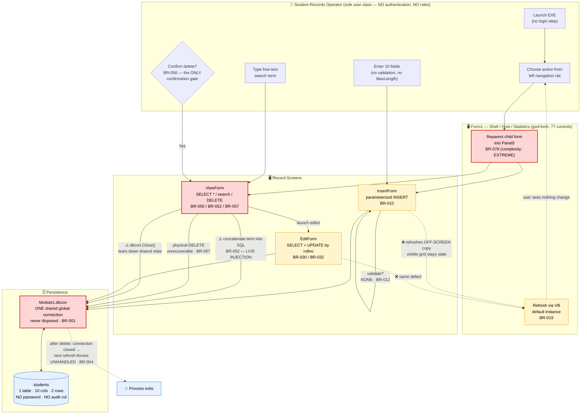
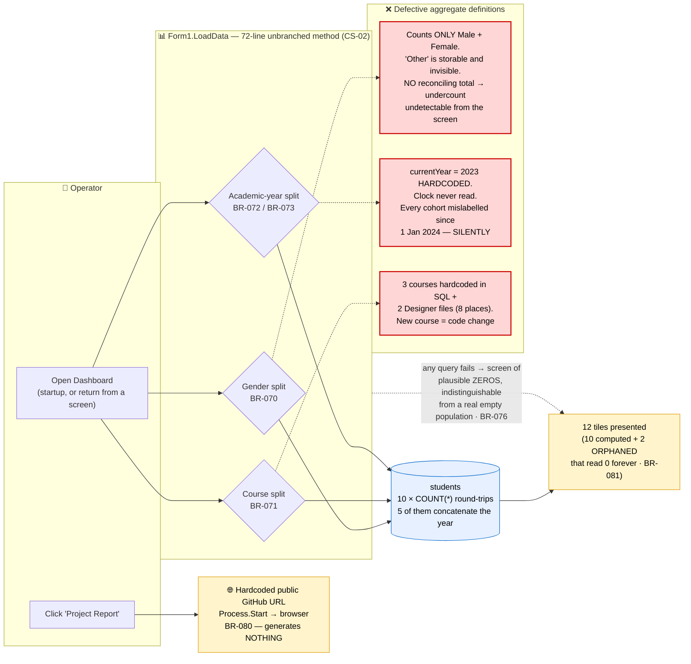
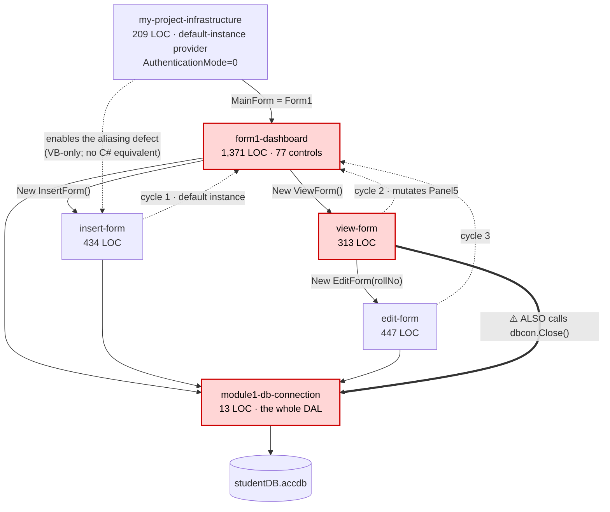
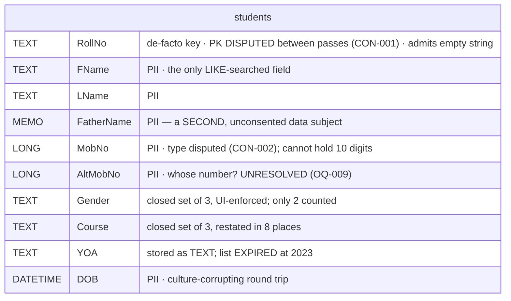
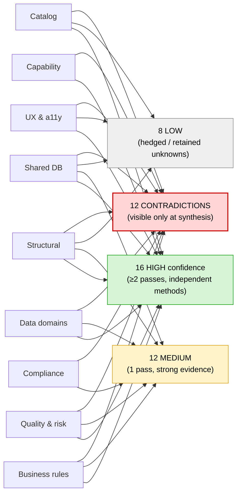

# Discovery Synthesis — Student Management System (VB.NET)

**Application ID:** `c70846ac-0948-4953-990c-c68a2be292d9`
**Synthesis date:** 2026-10-02
**Governing client profile:** `faa` (declared authoritative — see the scope warning below)

> ## ⚠️ READ THIS FIRST — THE ANALYSIS TARGET IS UNCONFIRMED
>
> The governing client profile for this task is declared authoritative as `faa`, and this
> synthesis honoured that declaration: policy was read only from the FAA profile and no
> alternative profile was adopted or assumed. **But the application analysed is a
> single-developer VB.NET WinForms student-records desktop tool** — GPL-licensed, public
> GitHub origin, one commit, with an author-credited academic project report. It contains
> no aviation, NAS, air-traffic, certification or safety content of any kind, and the FAA
> profile's own .NET technology mapping defines no modernization target for a VB.NET
> WinForms plus Microsoft Access stack.
>
> **Seven Discovery passes raised this independently**, each from a different angle. None
> adopted an alternative profile and none resolved it, because none could.
>
> Two readings are possible and the evidence does not choose between them: either the
> wrong repository was staged against this portfolio slot, or the application genuinely
> belongs to the portfolio as a minor administrative system and the profile needs a
> classification path for non-aviation tools. **This ranks first among the gate asks**
> (`analysis-scope-unconfirmed`), because every other artifact in this package is
> internally consistent with whatever target was analysed — so an automated pre-review
> will score the package highly even if the target is wrong.

---

## Input completeness

Ten canonical Discovery passes were present and consumed. **No expected pass was missing**,
so nothing in this synthesis rests on an unexplained gap. Two further specialist passes do
not apply to this application by subject, and both say so in their own text rather than
being excused by this one.

| Pass | Status | Consumed as |
|---|---|---|
| Catalog | ✅ present | `catalog.json` — identity, tech fingerprint, `complexity_tier`, first statement of the scope discrepancy |
| Structural | ✅ present | `structural-analysis.json` — 6 modules, 15 coupling indicators, schema summary, interface inventory |
| Structural specialist (.NET) | ✅ present | `dotnet-fingerprint.json` — `net48`/WinForms/`WinExe`, findings F-001…F-009 |
| Business rules | ✅ present | `business-logic.json` — 60 rules, 4 state machines, 34 implicit-logic findings |
| Quality & risk | ✅ present | `quality-risk.json` — debt 74/100, 21 smells, coverage `unavailable`, escalation ESC-1 |
| UX & accessibility | ✅ present | `ux-accessibility.json` — 4 surfaces, 1 persona, 9 findings, gate decision **FAIL** |
| Data domains | ✅ present | `data-domains.json` — 3 logical contexts, 8 logical entities, 7 boundary violations |
| Shared database | ✅ present | `shared-db-analysis.json` — sharing verdict `none-detected`, 7 decomposition risks |
| Capability | ✅ present | `capability-catalog.json` — 2 capabilities, 1 business domain *(consumed with a caveat — see CON-004)* |
| Compliance citations | ✅ present | `compliance-citations.json` — a measured zero: 0 citations of any authority |
| Document-imaging corpus | ⬛ **N/A by subject** | No TIFF/TIF file and no imaging, scanning or OCR code exists. The artifact was emitted because the pipeline declares this specialist unconditionally, and it self-declares *"NOT APPLICABLE … SHOULD NOT BE SCORED"*. See CON-009. |
| SQL Server object inventory | ⬛ **N/A by subject** | No SQL Server instance, connection or artifact exists; the only database is a local Microsoft Access file. All twelve object collections are empty as a *measured* finding. See CON-009. |

**Nothing is `absent_expected`.** Had an expected pass been missing, it would be stated here
as a pipeline gap with the affected dimensions capped at `medium` confidence — not explained
away.

---

## At a glance

| Metric | Value |
|---|---|
| Modules analysed | 6 |
| Total LOC / hand-written LOC | 2,787 / **461** (2,326 are generated layout) |
| Human-facing surfaces | 4 (plus 1 outbound browser launch) |
| Business rules recovered | 60 — 40 critical, 37 implicit, 23 needing SME review |
| Database | **1 table, 10 columns**, 0 procs / views / triggers / FKs |
| Measured data payload | **2 live rows** (~211 bytes) + 6 deleted rows in page slack |
| Authentication mechanisms | **0** |
| Inline SQL statements | 16, all in UI event handlers; 6 concatenated, **1 injectable** |
| Test coverage | **`unavailable`** — no test project, no CI, 1 commit |
| Accessibility annotations | **0 of 137 controls** → gate decision **FAIL** |
| Technical debt | 74/100 (high) · ~45 smells per KLOC |
| Complexity tier / Risk tier | `simple` / **HIGH** |
| **Business criticality** | **1 of 5** (medium confidence) — *orthogonal to complexity; see below* |
| Consolidated findings | **36** — 16 high / 12 medium / 8 low confidence |
| Architecturally significant | **25** (the ADR-coverage denominator) |
| Cross-pass contradictions | **12** |
| Open questions | 13 (1 blocking) |

**The headline tension:** this is a *structurally simple* application carrying a *high-severity
security and data-governance posture*. Criticality `1` and risk `HIGH` are not in conflict —
they answer different questions. Criticality asks *what breaks if this stops* (nothing we can
find). Risk asks *what is wrong with it* (a great deal). A low criticality rating **does not
license deferring the personal-data exposure**, which is routed independently as OQ-005.

---

## Business Process Model

The application has a genuine multi-step workflow across four screens, so a consolidated BPM
is warranted. Two diagrams are given because the system has two distinct process domains that
share a data store but not a flow: the **record-maintenance flow** and the
**statistics/reporting flow**.

Red nodes are modules the quality & risk pass ranked highest-risk. Dashed edges are
**defective in the legacy system** — they do not do what the interface implies.

### Diagram 1 — Record maintenance (the CRUD flow)

### Diagram 2 — Statistics / reporting flow

**What the BPM shows that no single pass could:** there is no approval step, no second
actor, no validation gate and exactly one confirmation dialogue in the entire system — and
the *only* path that reaches the data safely is the parameterized INSERT. Every other path
is either defective (the dashed refresh edges), dangerous (the concatenated search), or
destructive without recourse (the physical delete).

---

## Module dependency graph

Three cycles, **all through the shell**. No UI module is a leaf except by accident, so there
is no acyclic extraction order among the four screens as they stand.

## Shared data model

One table. No relationships, no foreign keys, no procedures, no views, no triggers, no
database links — **all measured findings, not unfilled fields.** No audit, soft-delete or
provenance column anywhere.

## Which pass contributed which finding

---

## Per-module merged view

| Module | LOC | Rules | Debt | Smells | UI surface | A11Y findings | Observed by |
|---|---|---|---|---|---|---|---|
| `form1-dashboard` | 1,371 | 12 | **high** | 5 (77 controls unannotated) | Dashboard / shell / host | 6 of 9 | structural, rules, quality, ux, data-domains |
| `insert-form` | 434 | 14 | medium-high | 5 | Record entry | A11Y-007 | structural, rules, quality, ux, data-domains |
| `edit-form` | 447 | 9 | medium | 5 | Record amendment | — | structural, rules, quality, ux, data-domains |
| `view-form` | 313 | 15 | **high** | 4 (incl. the sole injection) | Record list / search / delete | A11Y-002 | structural, rules, quality, ux, data-domains |
| `module1-db-connection` | 13 | 6 | **high** (highest-risk) | 2 | — *(no UI surface)* | — | structural, rules, quality |
| `my-project-infrastructure` | 209 | 4 | low | 0 | — *(no UI surface)* | — | structural, rules, quality |

**Modules seen by one pass and not another are a signal, not noise.** The two modules with no
UX observation genuinely have no UI surface — that is N/A by subject, not a gap. Conversely
`module1-db-connection` is 13 lines and carries the *highest* risk rating in the application,
because every other module's correctness depends on a lifecycle discipline it does not have.

---

## Cross-pass contradictions

Twelve recorded, **both claims preserved in every case**. Full reconciliations are in
`synthesis.json:contradictions`.

| ID | Topic | Reconciliation |
|---|---|---|
| CON-001 | Does the table declare a primary key? | **Resolved for the better-evidenced pass** (index-leaf-page decode beats an unresolved string count) — but the *operative risk is unchanged*: both sides agree uniqueness is enforced nowhere. The "incorrectly reported" language used against the conservative pass should not be carried forward. |
| CON-002 | Are the column data types known? | **Not resolved — open question.** Neither dominates. Carried at `medium`; **no target DDL may be generated** until OQ-003 closes it. |
| CON-003 | Was the row count measured? | **Resolved for the measurement.** A page-level census reporting 2 rows at a cited offset outranks "no measurement was taken", which is a true statement about a different pass's scope. |
| CON-004 | Did `data-domains.json` exist when the capability pass ran? | **Both true — a pipeline-ordering defect.** The capability pass ran before its required input existed, so its grain is *under-informed, not wrong*. Visible only at synthesis. |
| CON-005 | Does the application have a regulatory surface? | **Not a conflict of fact but of reading.** Zero in-source citations ≠ no applicable obligation. A consumer reading the citation artifact alone would wrongly conclude there is no regulatory surface. |
| CON-006 | How large is the PII exposure? | **Both stand; they answer different questions.** The exposure is real (claim A) *and* the payload is 2 rows of implausible-looking data (claim B). The remediation ask keeps full severity; the criticality rating uses claim B. |
| CON-007 | How many user classes? | **Resolved by distinguishing tiers.** One *application* persona, but two *access paths* — the unprotected file makes anyone with filesystem read access an unaudited second class. |
| CON-008 | How many dashboard statistics / SQL statements? | **Resolved for the pass whose contract is to count them.** Defensible figures: **16 statements, 10 computed statistics across 12 tiles, 6 concatenated, 1 injectable.** Variants (12/9/5 statistics, 15 statements) must not be propagated. |
| CON-009 | Is there an imaging corpus / a SQL Server? | **Resolved: both N/A by subject.** No factual dispute — the emitted artifacts say so themselves. The risk recorded is that an OCR score at the scale minimum means *"no corpus assessed"* yet reads as *"assessed and found unreadable"* — opposite findings. |
| CON-010 | Is there a network surface? | **Resolved by scope.** Zero *inbound* surface; exactly one *outbound* browser launch. Both passes correct. |
| CON-011 | Did the quality pass find any vulnerabilities? | **Resolved — and it is a reporting defect to fix upstream.** `vulnerabilities: []` while the same artifact reports a confirmed exploitable injection as its #2 risk driver. Any consumer reading that field gets zero and is wrong. Routed as OQ-004. |
| CON-012 | Does the rule catalog imply tests exist? | **No real conflict, recorded to pre-empt a false positive.** 60 populated `test_hints` blocks are *prescriptive*, not observational. Zero tests exist — and those 60 blocks are the seed for the characterization suite. |

> **A synthesis reporting zero contradictions across ten passes on a non-trivial application
> would almost certainly be under-reporting.** Two of these twelve are not disagreements about
> the application at all, but defects in the pipeline (CON-004, CON-011), and both are routed
> upstream.

---

## Open questions

One is **blocking**. A non-blocking open question or a low-confidence finding is retained
*deliberately* — it is honesty, not oversight.

| ID | Domain area | Priority | Blocking | Question |
|---|---|---|---|---|
| **OQ-001** | Engagement ownership / portfolio scope | **critical** | **YES** | Is this the right application, and is the `faa` profile correctly assigned? |
| OQ-005 | Data protection / privacy | critical | no | Who owns remediation of the committed student PII (ESC-1)? |
| OQ-002 | Discovery pipeline operations | high | no | Re-run capability extraction now its required input exists? |
| OQ-003 | Data engineering / DBA | high | no | One engine session to settle column types, keys and row count. **Blocks target-schema generation.** |
| OQ-004 | Pipeline ops / security reporting | high | no | Populate (or rename) the empty `vulnerabilities` field. |
| OQ-008 | Business stakeholder / product | high | no | Are the statistics definitions intended as written? Three defects are bug-or-intent ambiguous. |
| OQ-009 | Business stakeholder / data governance | high | no | Any retention, auditability or erasure obligation? Whose number is the alternate mobile? |
| OQ-010 | Disposition ownership | high | no | Should this be modernized at all, or retired/replaced? |
| OQ-006 | Compliance / accessibility governance | medium | no | Which obligations actually apply, given zero in-source citations? |
| OQ-007 | Discovery pipeline operations | medium | no | Make the imaging and SQL Server specialists conditional on detected engine/corpus. |
| OQ-011 | Business stakeholder / operations | medium | no | Is there a real user population, and more than one role? |
| OQ-012 | Discovery evidence completeness | medium | no | Extract and assess the 868 KB project report that no pass parsed. |
| OQ-013 | Business stakeholder / data model | medium | no | May a student hold more than one enrolment? What about post-2023 intakes? |

---

## Business criticality — 1 of 5

**Rated, not declined** — and the distinction matters. We did not say "we could not tell";
we found positive, converging, measured evidence of negligible operational consequence:

- **2 live rows** (~211 bytes); the 800 KB file is stock-template furniture
- those two rows carry a **2009 date of birth against a 2019 admission year** — implausible, reads as test data
- the admission-year picker **expired in 2023** — no later intake can be recorded at all
- the database path is **hardcoded to the original author's D: drive**; a clean clone cannot connect
- the author's own README and report describe a **personal academic project**

Evidence that *raised* the rating is recorded too, not suppressed: the application is the
**sole system of record** for its data with no documented fallback, and it is user-facing
across the full CRUD path.

> ⚠️ **Three things this rating is NOT.**
> 1. **Not a risk tier.** Risk is `HIGH`; criticality is `1`. Different questions.
> 2. **Not correlated with complexity.** `complexity_tier` is `simple`, echoed beside the
>    rating for side-by-side reading *only*. The two axes are orthogonal by contract — a
>    simple-but-critical application must not read as low priority, which is exactly what
>    collapsing them produces.
> 3. **Not a licence to defer the PII remediation.** ESC-1 is independent of sequencing.
>
> `safety_tier` is **deliberately null**. A safety tier is a formal determination a safety
> authority makes; inferring one from Discovery evidence would manufacture a safety claim.
> Leaving it null is correct behaviour, not a gap.

Confidence is **medium**, with six named gaps in `missing_inputs` — no CMDB, no business
owner, no criticality classification, no deployment confirmation, no telemetry, and the
unresolved scope question.

---

# Onboarding Guide

*For anyone meeting this system for the first time.*

## Domain glossary

| Term | Plain-language meaning |
|---|---|
| **Roll number** (`rollno`, `RollNo`) | The institution's student identifier, typed in by hand. Used as the record key by every single-record read, update and delete — but it is a *text* field that accepts the empty string, sorts alphabetically (so "10" comes before "2"), and nothing checks it is unique. |
| **YOA** | *Year of Admission* — the academic year a student entered. Never spelled out anywhere in the application; it appears as the raw abbreviation `YOA` in the record list, which is accessibility finding A11Y-002. |
| **BCA / MCA / IIMCA** | The three computing degree programmes this system knows about (Bachelor / Master / Integrated Master of Computer Applications). Hardcoded in at least eight places. |
| **Academic-year cohort** | A dashboard bucket ("1st Year", "2nd Year", …) derived by subtracting the admission year from a **hardcoded 2023**. Every cohort has been mislabelled since 1 January 2024. |
| **FatherName** | The guardian's name. Significant beyond its label: it is personal data about a **second person who never consented**, stored inside the student's own row with no separate identity and no independent erasure path. |
| **`.accdb` / `.laccdb`** | A Microsoft Access database file, and its lock file. Both are committed to the repository — the lock file proves the database was open in Access when the commit was made. |
| **ACE OLEDB** | The Microsoft client component the application uses to reach the Access file. Out of support since 2017, must be installed separately on every workstation, and forces a 32-bit build. |
| **Default instance** | A Visual Basic–only feature that silently creates a *second, invisible copy* of a screen when you refer to it by type name. The cause of the application's most consequential defect — and it has **no C# equivalent**, so it cannot be ported, only redesigned. |
| **Designer file** (`*.Designer.vb`) | Auto-generated screen-layout code. 2,326 of the 2,787 lines (83%) are Designer files, which is why the real size of this system is **461 hand-written lines**. |
| **`OptionStrict Off`** | A build setting that disables type checking. Combined with looking up database columns by name as text, it means the data contract is resolved when the program *runs*, not when it is *built* — so a renamed column fails in front of a user, never in the build. |
| **Page slack** | Unused space inside a database file where deleted rows physically remain. Six deleted student records were recovered from it: the data was neither recoverable by the operator nor actually destroyed. |

## The system in one paragraph

This is a single-user Windows desktop program, written by one developer in Visual Basic .NET,
that keeps a list of students and their course details in a Microsoft Access file stored on
the same computer. It has four screens: a dashboard of counts (how many students by gender,
by course, by year), a form to add a student, a searchable list to browse or delete them, and
a form to edit one. There is no login, no user accounts and no roles — anyone who opens the
program can read, change or delete every record, including names, phone numbers and dates of
birth. It talks to nothing else: no website, no service, no scheduled job, and no other system
shares its data. Its own documentation describes it as an academic portfolio project, the
database it ships with holds two records that look like test data, and the dropdown for year of
admission stops at 2023 — so on the available evidence it is not in operational use anywhere.
Its significance to this programme is therefore an open question, and the first thing a
reviewer is asked to settle.

## What to check first, by role

### 🧑‍💼 Operator
- **Where the traffic would be:** `form1-dashboard` is the startup screen and runs ten database
  round-trips before anything is displayed; `view-form` is the only way to find or delete a record.
- **Highest incident risk:** `view-form` and `module1-db-connection`. Deleting a record **closes
  the shared database connection**, and the next dashboard refresh then **crashes the application**
  (BR-004). This is reachable in normal use.
- **Manual intervention required:** the application **cannot connect to its own database** from a
  clean installation — the path is hardcoded to the original developer's computer. A code change
  and rebuild are needed to point it anywhere else (BR-002).
- **Trust nothing on the year tiles.** Every academic-year count has been wrong since January 2024.
- **The dashboard does not add up**, and there is no total shown to reveal it: any student recorded
  with gender "Other" is counted nowhere.

### 👩‍💻 Developer
- **Highest complexity:** `form1-dashboard` — a 1,211-line generated layout file with 77 controls,
  acting simultaneously as the navigation shell, the child-screen host *and* the statistics engine.
  Splitting it is itself a work item.
- **Most inter-module dependencies:** again `form1-dashboard` — it owns **two of the three
  dependency cycles**, and the third runs through it as well.
- **Weakest test coverage:** all of it. There is **no test project, no CI pipeline and no build
  script**, and a one-commit history. Note the trap: all 60 business rules carry `test_hints`
  blocks, but those are *suggestions written by the analysis*, not evidence that tests exist (CON-012).
- **Read before touching anything:** `Module1.vb` — all 13 lines. One global connection, opened by
  four screens, closed by one, disposed by none. It is the whole data-access layer.
- **The build does not work from a clean clone** (missing signing key; `Debug` maps to `Release`),
  so nothing here has been verified by compiling.

### 📊 Analyst
- **Most critical rules:** 40 of the 60 are severity `critical`. Start with **BR-072** (hardcoded
  2023 year), **BR-070** (gender undercount), **BR-052** (SQL injection), **BR-057** (unrecoverable
  delete) and **BR-090** (no authentication).
- **Most exceptions and edge cases:** `BR-078` is the only rule rated complexity **extreme** (the
  navigation/hosting mechanism). `BR-019`, `BR-033`, `BR-034` and `BR-072` are rated `high`.
- **Flagged for your confirmation:** **23 of 60 rules** carry `requires_sme_review`. The three
  that matter most are genuinely ambiguous between *bug* and *intent* and cannot be settled by
  reading code: the 2023 year baseline, the two-of-three gender census, and the post-insert
  refresh landing on an invisible screen copy (OQ-008).
- **Where business meaning lives:** inside screen event handlers, nowhere else. There is no
  service layer, no stored procedure and no documentation of the rules.

### 🛠️ Admin
- **Infrastructure:** one 32-bit Windows executable, installed by hand per workstation, plus one
  Microsoft Access file. No server, no service, no scheduler, no queue.
- **External integrations:** exactly one, and it is outbound only — the "Project Report" button
  launches the user's browser at a hardcoded public GitHub URL. It generates no report.
- **Prerequisite:** the 32-bit Microsoft Access Database Engine redistributable must be installed
  on every machine. It is out of support (2017).
- **Security posture:** **no authentication, no authorization, no encryption, no audit.** The
  database file has **no password**, so filesystem permissions are the only control over every
  student's personal data — and the file can be opened directly in Microsoft Access by anyone who
  can read it, bypassing the application completely. One confirmed, exploitable SQL-injection path
  reads the whole table. The populated database is committed to a **public** repository. This is
  escalation **ESC-1**, still open.
- **Concurrency:** multiple copies may run against the same file at once, with no transactions and
  last-write-wins. Only Access's own file locking stands between them.

## Known complexity hotspots

| # | Module | Why it is complex | Downstream impact |
|---|---|---|---|
| 1 | **`form1-dashboard`** | Three jobs in one class — shell, screen host, statistics engine — across a 1,211-line generated layout with 77 controls. Owns 2 of 3 dependency cycles plus a silent data-correctness defect (hardcoded 2023). | Cannot be assigned to one target boundary; the shell and the statistics concerns provably overlap on this module, so splitting it is a work item in its own right before any screen can be extracted. |
| 2 | **`module1-db-connection`** | 13 lines, yet the highest-risk module in the application: a shared, globally mutable, never-disposed connection with a hardcoded unreachable path, which every other module's correctness depends on. | **Every decomposition boundary must cut this edge first.** Nothing else can proceed until connection-per-operation and real transactions exist. |
| 3 | **`view-form`** | Holds the only confirmed SQL injection, unilaterally closes the shared global connection, reaches into its grandparent's control tree to host another screen, and triplicates its own data-loading logic across three methods. | Carries both the top security finding and the tightest coupling point; it is the hardest screen to extract and the most urgent to fix in place. |
| 4 | **`insert-form`** | Zero validation anywhere on the create path, three unguarded dropdown dereferences, a catch-all handler that shows raw database errors to users, and the default-instance defect that leaves sibling screens stale. | Validation is a **new requirement**, not a port — there is nothing to carry forward. 14 business rules and the create-path state machine depend on getting this right. |
| 5 | **`edit-form`** | Duplicates the insert screen's field mapping (so rules can already drift between them), performs no uniqueness check on the de-facto key, and parses dates culture-independently on read but culture-dependently on write. | A 1:1 port would carry the duplication and the date-corruption path forward. The two screens must collapse into one record-editor component. |

---

## For the gate reviewer

1. **Answer `analysis-scope-unconfirmed` first.** Everything else is conditional on it.
2. **Then `business-criticality-confirmed`** — a rating of 1 of 5, produced at medium
   confidence, with the evidence that argued *against* it recorded alongside.
3. **Then `synthesis-recorded`** — the outcome for the record.
4. **Separately, ESC-1 needs a named owner** (OQ-005). It is deliberately decoupled from
   modernization sequencing, because remediation of a public data exposure should not wait on
   a migration plan.

**Artifacts in this package:** `synthesis.json` (36 findings, 12 contradictions, 13 open
questions) · `business-criticality.json` · `downstream-pointers.json` · the SRS set
(`srs.json` + 5 detail files: 70 requirements over 5 modules, 66 anomaly resolutions, 20
needing SME confirmation) · this narrative.
