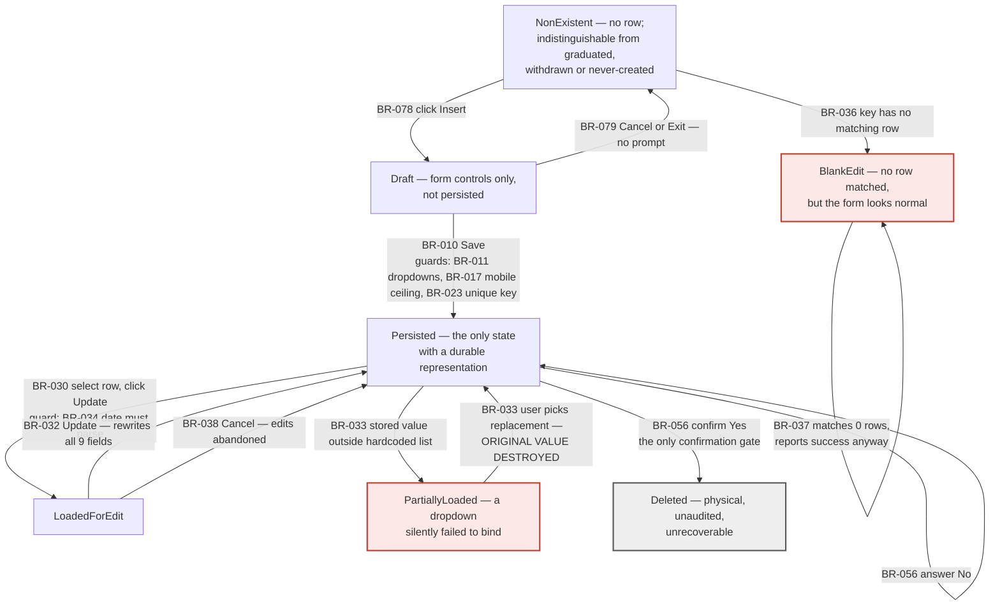
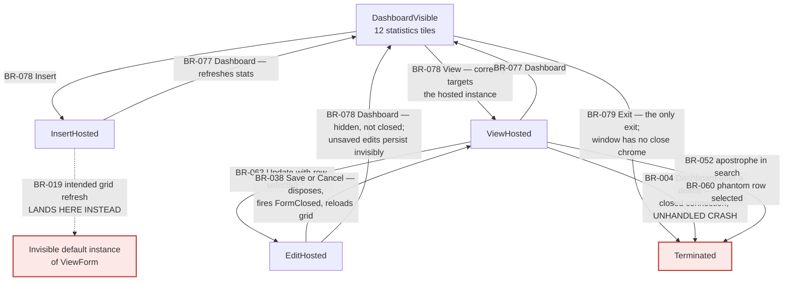
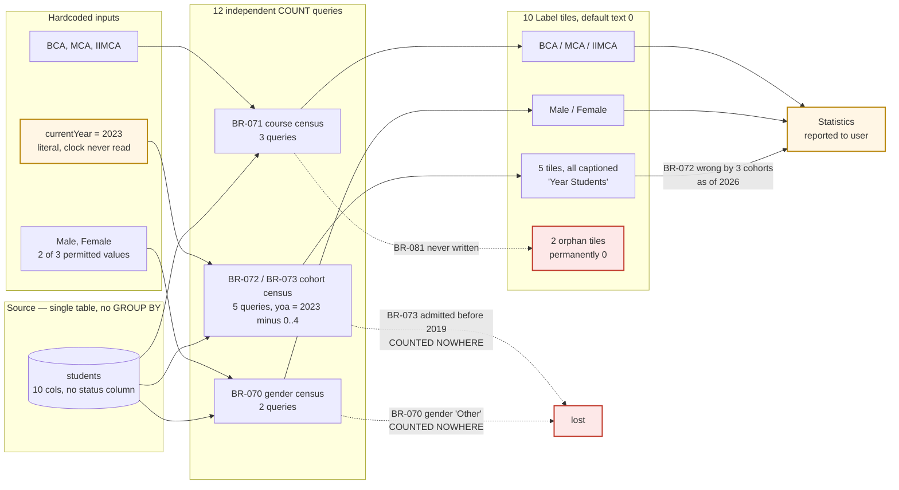

# Business Logic Report — Student Management System (VB.NET)

**Application ID:** `c70846ac-0948-4953-990c-c68a2be292d9`
**Discovery pass:** Pass 2 — business logic extraction
**Governing client profile:** `faa` (authoritative, per dispatch declaration)
**Source:** `Flat Design/` — VB.NET WinForms, .NET Framework 4.8, Microsoft Access ACE backend
**Extraction date:** 2026-10-02

---

## 1. Summary

| Measure | Value |
|---|---|
| Business rules extracted | **60** |
| Implicit behaviours catalogued | **34** |
| State machines recovered | **4** |
| Rules flagged for SME review | **23** |
| Rules whose logic is *implicit* (not stated in code as intent) | **37 of 60 (62%)** |
| Hand-written source analysed | 461 lines across 5 files |
| Designer / generated source analysed | 2,326 lines |
| Database objects | 1 table, 10 columns, 2 live rows |

**By category:** workflow 21 · constraint 16 · validation 13 · calculation 9 · authorization 1
**By severity:** critical 40 · standard 18 · advisory 2
**By complexity:** low 31 · medium 24 · high 4 · extreme 1

The headline finding is the ratio in the table above: **62% of this application's business rules are implicit.** They are not expressed as rules in code. They are emergent properties of Designer-generated UI properties, of the binary Access table definition, of VB.NET language and WinForms framework semantics, and of three `.vbproj` compiler switches. A reader of the 461 hand-written lines alone would recover roughly a third of the system's actual behaviour.

Three specific consequences for modernization:

1. **The domain model does not exist in the application code.** The permitted genders, courses and admission years are declared *only* as literal `Items.AddRange` collections inside Designer files — four locations for the year list, eight for the course taxonomy. There is no lookup table, no enum, no constant, and no database check constraint.
2. **The only field-length and numeric-range constraints in the system live in a binary file.** They were recovered by decoding `studentDB.accdb` directly. One of them (§5.1) makes a core field unusable for its stated purpose.
3. **Five of the twelve statistics this application reports are wrong today** and will be wronger every year, because the academic-year calculation is anchored to a hardcoded `2023`.

---

## 2. Regulatory applicability — NOT APPLICABLE

> **This is a finding, not a skipped step.**

The skill scopes regulatory cross-referencing to applications whose business rules derive from a regulation, identified by matching the application against `applicable_systems` in `profiles/faa/compliance.yaml` → `regulatory_sources`.

**Determination: no match on any entry. No regulatory mapping was performed.**

| `faa` regulatory source | `applicable_systems` (abridged) | Match |
|---|---|---|
| 14 CFR Part 47 — Aircraft Registration | Civil Aviation Registry, N-number assignment, Dealer's Certificate workflows | ✗ |
| 14 CFR Part 61 — Pilot Certification | IACRA, Airmen Certification DBs, DMS, Medical cert, Flight Standards | ✗ |
| 14 CFR Part 63 — Other Flight Crewmembers | IACRA, Airmen Certification DBs, DMS, Flight Standards | ✗ |
| 14 CFR Part 67 — Medical Standards | AMCS, MedXPress, IACRA, AME systems, Federal Air Surgeon | ✗ |
| 14 CFR Part 183 — Representatives of the Administrator | DMS, IACRA, ODA management, Aircraft Certification | ✗ |

This application manages **student academic records for three computing degree programmes (BCA, MCA, IIMCA)**. Its single 10-column table holds roll number, names, father's name, two mobile numbers, gender, course, year of admission and date of birth. There is no airman, certificate, rating, medical, endorsement, aircraft, registration, designee or examiner concept anywhere in the schema or in the 461 lines of hand-written code.

**Consequences, applied deliberately:**

- Every rule in this catalog is a **business convention, a defect, or an implementation artifact** — none is a regulatory requirement.
- `regulatory_traceability` is **omitted from all 60 rules** rather than populated with a fabricated citation or a blanket `not_applicable` stub. A stub would imply a mapping exercise was performed against a regulation that does not govern this system.
- **No `BR-MISSING-NNN` records were generated.** A regulation this application does not implement cannot have implementation gaps.
- Coverage statistics, gap lists, drift lists and contradiction lists are **not reported**, because there is no applicable regulation against which a percentage would mean anything. Reporting "0% coverage of 14 CFR Part 61" would be actively misleading.

### 2.1 Profile-assignment discrepancy — for the profile owner

The governing profile declared for this dispatch (`faa`) does not plausibly govern this application's domain. Per the dispatch rules, **the declaration wins and was used as the sole source of policy** — no other profile directory was read. The discrepancy is recorded here rather than silently resolved:

- Pass 0 classifies `business_domain` as **"Admin"** and describes the application as a single-developer academic/portfolio project with no network, web or batch component.
- No input artifact asserts a different governing profile, so there is no competing claim to adjudicate — the mismatch is between the profile's *regulatory scope* and the application's *domain*.
- Either this application is mis-assigned to the `faa` profile, or `faa`'s `regulatory_sources` needs an entry covering non-aviation administrative systems.
- Separately: the Part 47 `applicable_systems` list in `profiles/faa/compliance.yaml:183` still carries an unresolved `TODO(human)` marker, so that list is self-described as unconfirmed. This did not change the determination — the application matches no entry on any of the five lists, confirmed or not.

**Escalation:** profile assignment review. Not a business-logic finding.

---

## 3. Rule inventory by module

| Module | Rules | Role | Dominant category |
|---|---|---|---|
| `view-form` | 15 | Read, search, delete; launches edit | workflow |
| `insert-form` | 14 | Sole record-creation path | validation |
| `form1-dashboard` | 12 | Shell, navigation, all 12 statistics | calculation |
| `edit-form` | 9 | Sole record-update path | workflow |
| `module1-db-connection` | 6 | Entire data-access layer — 13 lines | constraint |
| `my-project-infrastructure` | 4 | Build settings & app framework config | constraint |

`my-project-infrastructure` deserves note: four rules that exist **only as build and framework settings**, yet govern behaviour everywhere — no authentication or authorization at all (BR-090), `Option Strict Off` as the enabling precondition for five runtime-only failure modes (BR-091), case-sensitivity divergence from the database engine (BR-092), and concurrent instances with last-write-wins (BR-094).

---

## 4. Process diagrams

### 4.1 Student record lifecycle (workflow rules)

Edge labels carry the BR-ID of the rule governing each transition. Red states are reachable, visually indistinguishable, and destructive.

**Reading:** the record has **no persisted state** — the schema has no status, version or timestamp column, so a record's state *is its existence*. "Enrolled", "graduated" and "withdrawn" are therefore indistinguishable (BR-075), and the only terminal transition is physical destruction (BR-057). The two red states are the extraction's most important workflow finding: both look like a normal edit form, and saving from either one silently writes wrong data.

### 4.2 Navigation shell and refresh cascade (workflow rules)

**Reading:** three paths reach `Terminated` by **unhandled exception**, not by user intent. The insert path's grid refresh (dotted) never reaches the visible grid at all — it resolves to a second, invisible `ViewForm` via VB's default-instance feature (BR-019). The `View` navigation handler, by contrast, uses a guarded `DirectCast` against the hosted instance; that contrast is the clearest evidence the default-instance calls elsewhere are unintentional rather than designed.

### 4.3 Statistics calculation chain (calculation rules)

**Reading:** every statistic is a whole-table `COUNT` with a single-attribute predicate — there is no `GROUP BY` anywhere, and **no tile reports a grand total**. That absence matters: it is why the two silent undercounts (gender `Other`, pre-2019 admissions) are undetectable from the UI. There is no cross-check between the three axes.

### 4.4 Authorization rules — no diagram

**No process diagram — the module contains 1 isolated authorization rule with no decision tree to draw.**

BR-090 records a complete **absence**: no login, no user identity, no roles, no permissions, no actor audit. `AuthenticationMode.Windows` is set in the application framework config, but it only governs the `My.User` object, which no code path ever reads. There is no access-control decision tree, no role hierarchy and no escalation path to diagram — anyone who can launch the executable has unrestricted CRUD over all student and parent personal data, and anyone with file-system access to the unencrypted, password-free `.accdb` has the same authority without the application at all.

This is recorded explicitly *because* it is an absence: a modernization target that assumes authorization logic exists somewhere in this code will find nothing to port.

---

## 5. Critical findings requiring escalation

### 5.1 Mobile number fields cannot store a real mobile number — BR-017 / IM-006

`MobNo` and `AltMobNo` are **4-byte Long Integer** columns (max `2,147,483,647`), confirmed by decoding the table-definition page of `studentDB.accdb` directly — this constraint appears in no source file. Every ten-digit Indian mobile number begins with 6, 7, 8 or 9 and therefore **exceeds the column ceiling**. The entry form collects them as unconstrained free text with no `MaxLength` and no numeric validation, so the failure surfaces only as a raw provider message in a message box (BR-022).

Integer storage additionally discards leading zeros, country prefixes, spaces and `+` signs for any value that *does* fit.

**Why this is escalated:** a contact field in the system of record is structurally unusable for its stated purpose, and the defect is invisible to anyone reading the application source. Target schema must use a string type. **SME confirmation required** on whether this field has ever held real data.

### 5.2 All cohort statistics are frozen at academic year 2023-24 — BR-072 / IM-001

`currentYear` is the literal `2023`; the system clock is never read. As of extraction the dashboard **mislabels every cohort by three years** — students admitted in 2023 are reported as first-years when they are fourth-years. The admission-year dropdown is independently frozen at the same five literals (BR-015), so the two halves of the year logic remain *superficially consistent while both are wrong*, and no error is ever raised.

**Compounding:** no student admitted after 2023 can be recorded through any application path at all.

### 5.3 Records can be silently corrupted by merely opening and saving them — BR-033 / IM-014

Loading a record assigns stored values to `ComboBox.SelectedItem`, an exact **case-sensitive** lookup in the hardcoded `Items` list. A value not found is **silently ignored** and the control is left blank — the form looks normal. Saving then rewrites all nine mutable fields unconditionally (BR-032), so if the user selects any replacement value in the blanked dropdown, **the original stored value is destroyed**. If they do not, the save throws a generic object-reference error.

Because the year list has already expired, this rule will capture **every** record created by any future means.

### 5.4 Delete corrupts the shared connection; next navigation crashes — BR-004 / IM-019

The delete path contains the application's only `dbcon.Close()`. The view form's own reload survives because `DataAdapter.Fill` opens and closes implicitly — **masking the defect at the one call site that would have revealed it**. The dashboard's statistics loader calls `ExecuteScalar` *without* calling `connectDB()` first, so **delete → click Dashboard** raises an unhandled `InvalidOperationException` and terminates the application. Shortest reproduction: two clicks.

### 5.5 Search is the sole injection point, and breaks on legitimate names — BR-052 / IM-025

Every other data path is parameterized. The search concatenates raw input into the `WHERE` clause with no escaping and no `MaxLength`. A legitimate apostrophe — `O'Brien` — crashes the application with an unhandled syntax error; a crafted term reads arbitrary table content straight into the visible grid, which gives the injection a direct output channel. ACE rejects stacked statements, which limits but does not eliminate the exposure.

### 5.6 No authorization, no audit, no provenance — BR-090 / BR-095

No identity, roles or permissions (§4.4). Combined with physical deletion (BR-057) and a schema with **no actor, version or timestamp columns**, **no create, update or delete in this system is attributable or reconstructible after the fact**. Any modernization requirement for data lineage or data-subject requests over this personal data has nothing in the legacy system to build on.

---

## 6. Input-artifact conflicts resolved against primary evidence

Two Pass-1 inputs disagreed. Both were resolved by decoding `studentDB.accdb` directly rather than by preferring one artifact.

| Claim | `db-archaeology.json` | `db-schema.json` | Resolution |
|---|---|---|---|
| Primary key on `students` | `has_primary_key: true`, `RollNo` PK Required, 1 index | "**NO** primary key or unique index was found in the decoded file… uniqueness is assumed by the code and enforced nowhere" | **`db-archaeology.json` is correct.** A `PrimaryKey` index is present in the table definition. `db-schema.json` is wrong on this point. |
| `MobNo` / `AltMobNo` type | `LONG INTEGER` | not stated | **Confirmed:** type 4, length 4 — 32-bit. Basis for §5.1. |

**Why this mattered:** had the `db-schema.json` claim been accepted, BR-023 would have reported roll-number uniqueness as entirely unenforced and BR-037's multi-row update would have been an *active* defect rather than a latent one. The correction changes the severity of two rules. `db-schema.json` self-describes as a non-authoritative mirror; this finding supports that status and should be fed back to Pass 1.

---

## 7. SME review queue — 23 rules

**Ambiguous intent — is this designed behaviour or a defect?**
BR-011 (dropdowns mandatory only via exception) · BR-015 (expired year list) · BR-017 (mobile ceiling) · BR-023 (user-typed key) · BR-058 (delete skips dashboard refresh) · BR-070 (gender `Other` uncounted) · BR-072 (hardcoded 2023) · BR-073 (five cohorts, unjustified) · BR-090 (no authorization) · BR-094 (last-write-wins)

**Cross-module behaviour no single file describes:**
BR-002 (orphan database path) · BR-004 (connection close) · BR-019 (default-instance refresh) · BR-033 (un-editable records) · BR-034 (date round-trip) · BR-036 (blank edit form) · BR-037 (unbounded `WHERE`) · BR-062 (duplicate handlers) · BR-078 (**complexity: extreme**) · BR-092 (case-sensitivity divergence) · BR-095 (no provenance)

**Data-semantics questions:**
BR-016 (locale-dependent dates) · BR-060 (phantom grid row)

**BR-078** is the only rule rated `complexity: extreme` and carries `requires_sme_review: true`. It touches **four modules** and combines manual control reparenting, conditional instance reuse keyed on `IsDisposed`, z-order management, cross-module mutation of another form's control collection, and VB default-instance resolution. BR-019, BR-062 and BR-063 all depend on it, and no single file describes it.

---

## 8. Open questions

1. **Profile assignment** (§2.1) — is this application correctly assigned to the `faa` profile? Owner decision required.
2. **Has this application ever held production data?** Two live rows are implausible test data (2009 date of birth against a 2019 admission year), six further rows are recoverable from page slack, and the configured database path (§5.4 / BR-002) means the committed `.accdb` is **not** the file the application opens. If there was never real data, §5.1's practical impact is nil and the mobile-number finding is a design defect only.
3. **Is a fifth-year cohort meaningful?** The three recognised programmes are two- and three-year degrees (BR-073).
4. **Should gender `Other` be counted?** Adding it requires deciding whether the two existing gender tiles are meant to be exhaustive (BR-070).
5. **Is `yoa` a year or a session?** The column holds a single year, the UI labels it "Session", and the dashboard axis calls the course column "Degree" — three vocabularies for two columns (IM-033).
6. **Were `Button1`–`Button7` deleted?** `Button8` is the only control retaining a designer-default name, suggesting removed functionality (IM-034).

---

## 9. Artifacts produced

| File | Contents | Schema |
|---|---|---|
| `business-logic.json` | 60 rules with full traceability, dependencies and test hints | `discovery/business-logic.schema.json` ✓ |
| `state-machines.json` | 4 state machines, 44 transitions with BR-ID guards | `discovery/state-machines.schema.json` ✓ |
| `implicit-logic.json` | 34 implicit behaviours | `discovery/implicit-logic.schema.json` ✓ |
| `business-logic.md` | This report | — |

All three JSON artifacts were validated against their binding schemas; no optional key was emitted as `null`. Rule-dependency graph checked for referential integrity — all 60 IDs resolve, no dangling references.
