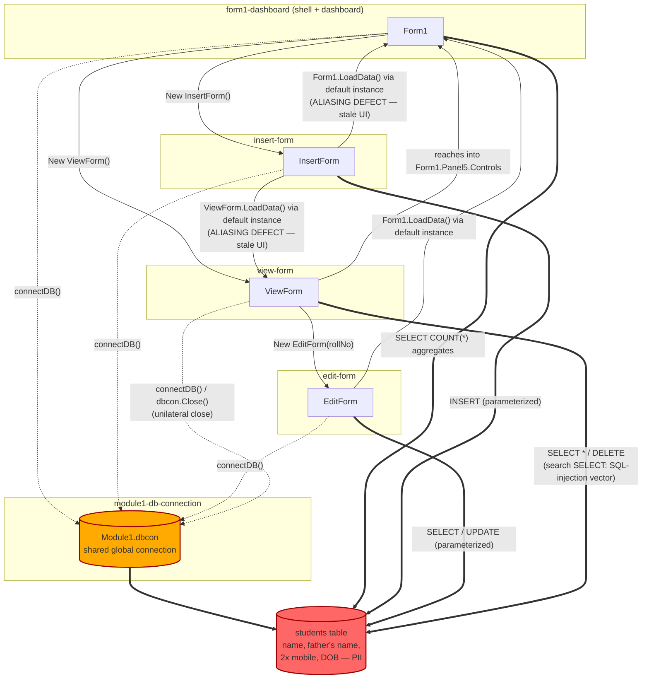
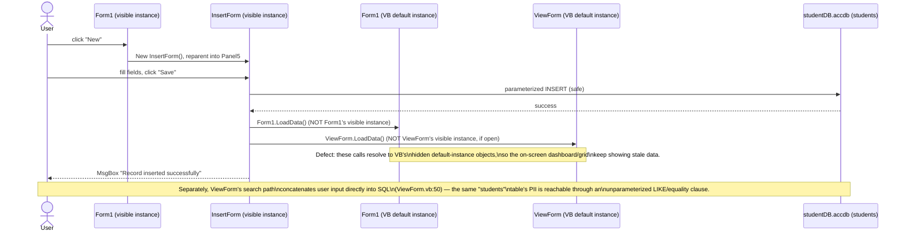

# Quality & Risk Assessment — Student Management System (VB.NET)

**Application ID:** `c70846ac-0948-4953-990c-c68a2be292d9`
**Assessment date:** 2026-10-02
**Pass:** Discovery Pass 3 — Quality & Risk Assessment (`quality-risk-assessor`)
**Structural map source:** `artifacts/discovery-structural-analysis/structural-analysis.json` (Discovery Pass 1)
**Inputs read directly by this pass:** `Flat Design/Form1.vb`, `Flat Design/InsertForm.vb`, `Flat Design/EditForm.vb`, `Flat Design/ViewForm.vb`, `Flat Design/Module1.vb` (all 461 hand-written lines), `Flat Design/Student Management System Siddharth Jain.vbproj`, `.gitignore`, plus Pass 1's `structural-analysis.json` and Pass 0's `catalog.json` for corroboration.

## Scope & governing-profile note

The governing client profile for this task is declared as `faa` (Federal Aviation Administration legacy-modernization program), and that declaration is authoritative for this run. However, both this pass and the upstream Pass 0 catalog independently observe that the application under assessment — a single-developer VB.NET WinForms "Student Management System" backed by a local MS Access file, with no network, aviation, NAS, or FAA business relevance anywhere in its source, README, or project report — does not match the FAA domain the profile targets. This is a probable scope/profile mismatch flagged by Pass 0 (`catalog.json.open_questions[0]`) and corroborated here; it is recorded as a discrepancy for the engagement owner to confirm, not adopted as fact and not treated as grounds to skip the assessment. The FAA profile's generic default rubric (`profiles/faa/scoring.yaml`, 80%-coverage baseline, default debt formula) was applied in the absence of any FAA-specific override for this skill (no `profiles/faa/skills/quality-risk-assessor/` directory exists).

## Overall risk tier: **HIGH**

This is a structurally simple application (1 build project, 6 logical modules, 2,787 total LOC of which only 461 are hand-written — the rest is WinForms Designer boilerplate) with **low code complexity** (max cyclomatic complexity ≈4, max afferent coupling 4) but **high security and governance risk**: a live, unauthenticated PII dataset in public source control, sitting behind a confirmed SQL-injection vector, with zero tests and a broken clean-clone build. The HIGH tier is driven by the security/governance axis, not by algorithmic or architectural complexity — see the per-module complexity dispositions below, all of which clear the numeric escalation thresholds.

**Top risk drivers:**
1. Live, unredacted student PII (name, father's name, two mobile numbers, DOB) committed to a public repository behind an application with zero authentication, authorization, or encryption.
2. Confirmed, exploitable SQL-injection vector at `ViewForm.vb:50` (free-text search concatenated into both an equality clause and a `LIKE` clause).
3. Zero automated test coverage and no CI/CD pipeline anywhere in the repository — no regression safety net, no executable specification of current behavior.
4. Hardcoded, author-machine-only absolute database path (`Module1.vb:7`) — a clean clone cannot connect to its own bundled database without a source change.
5. No data-access layer: all 16 SQL statements live inline in UI event handlers, joined only by one shared, globally mutable, never-disposed connection (`Module1.dbcon`) that one form (`ViewForm`) unilaterally closes.

**Highest-risk modules (by name):** `module1-db-connection`, `view-form`, `form1-dashboard` — see `quality-risk.json.risk_summary.highest_risk_modules` for the specific rationale behind each.

**Regulatory surface flags:** PII at rest with no encryption/access control; no authentication layer over PII CRUD; PII dataset exposed in public source control alongside a live injection vector. See `escalation-record.json` (ESC-1).

## Technical debt

**Score: 74 / 100 (band: HIGH)**, computed from the default rubric `debt = weighted_sum(smell_density, coverage_gap, vuln_count, churn_rate)`:

| Factor | Weight | Subscore | Basis |
|---|---|---|---|
| Smell density | 40% | 85/100 | 21 distinct code-smell findings across 461 hand-written LOC (~45/KLOC) |
| Coverage gap | 30% | 100/100 | No test suite exists at all (scoring-time assumption only — see Test Coverage section for why the artifact's `line_pct` stays unset rather than `0`) |
| Vuln count | 20% | 50/100 | 1 confirmed exploitable SQL-injection + 5 non-exploitable unparameterized constructs; no CVE/SCA data applicable (zero package dependencies — all GAC references) |
| Churn rate | 10% | 0/100 | Single-commit git history; no rate is computable, floored at 0 with low confidence rather than guessed |

`0.40×85 + 0.30×100 + 0.20×50 + 0.10×0 = 74`

Full reproducible inputs are in `quality-risk.json.technical_debt_score.contributing_factors`.

### Per-module debt

| Module | Band | Why |
|---|---|---|
| `module1-db-connection` | High | Shared mutable global state, never disposed, hardcoded unreachable path — all in 13 lines that every other module depends on |
| `view-form` | High | The app's only confirmed SQL-injection; closes the shared connection unilaterally; triplicated load logic |
| `form1-dashboard` | High | 1,211-line god-form Designer file; 72-line unbranched long method; hardcoded `currentYear = 2023` silently wrong since 2024; 5 unparameterized SQL statements |
| `insert-form` | Medium-high | Zero input validation; 3 unguarded null dereferences; default-instance aliasing defect leaves siblings stale after insert |
| `edit-form` | Medium | Duplicates InsertForm's mapping logic; no uniqueness check on the de-facto key; culture-inconsistent date handling |
| `my-project-infrastructure` | Low | Generated plumbing only; no hand-written logic, no SQL, no PII access |

## Vulnerabilities

**No dependency-level vulnerability data is available or applicable, and none is invented.** The project has zero package-manager dependencies — all 10 assembly references are GAC references resolved by the .NET Framework 4.8 install, with no NuGet, `packages.config`, or SBOM of any kind (`structural-analysis.json` confirms no `ci_cd_pipelines` and no dependency manifest). There is therefore no SCA/CVE surface to scan, and `quality-risk.json.vulnerabilities` is correctly empty rather than populated with a synthesized record. The one real security defect found — the SQL-injection construction at `ViewForm.vb:50` — is a code-level defect, not a dependency CVE, and is tracked instead as code smell `CS-18` (`sql-injection-vulnerable-construction`) and in `escalation-record.json` ESC-1.

## Test coverage

**Measurement unavailable — not zero.** No test project, test file, test-runner configuration, or CI/CD pipeline exists anywhere in the repository; this pass's own directory listing and Pass 1's independent `no-automated-verification` coupling indicator both confirm it. Per the skill's constraint, this is recorded as `measurement.method = "unavailable"` with a stated reason, and `line_pct`/`branch_pct`/`overall`/`gap_to_baseline_pct` are correctly omitted rather than reported as `0`. Qualitatively: there is no automated safety net of any kind, and any migration must be validated through newly-written characterization tests rather than a regression suite, exactly as Pass 1 recommended.

## Code smells

21 findings recorded in `quality-risk.json.code_smells`, each anchored to a module id from the Pass 1 structural map. Selected highlights (full file:line evidence for every item below is in `structural-analysis.json`'s `coupling_indicators`/`coupling_signals`, independently re-verified against source in this pass):

- **God-class** (`CS-01`): `Form1` + `Form1.Designer.vb` — 1,211 lines, 77 controls, simultaneously the navigation shell, child-form host, and statistics dashboard.
- **Long method** (`CS-02`): `Form1.LoadData()`, `Form1.vb:22-93` — 72 lines, 10 near-identical sequential `COUNT(*)` round-trips, no branching (so not a complexity hotspot, purely a length/duplication smell).
- **Hardcoded temporal constant** (`CS-03`): `Form1.vb:59` — `currentYear = 2023` has silently produced wrong academic-year tiles for every user since 1 Jan 2024.
- **Unparameterized SQL** (`CS-04`): `Form1.vb:62,67,72,77,82` — 5 statements concatenate an integer into SQL text; not currently exploitable (integer-derived), but the same unsafe habit that is exploitable in `ViewForm`.
- **Accessibility unannotated** (`CS-05`): 0 `AccessibleName`/`AccessibleDescription` across 137 controls app-wide (77 on the dashboard alone) — handed to the downstream `ux-accessibility-assessor` pass as a measured zero.
- **Duplicated code** (`CS-06`, `CS-11`): `InsertForm.vb:12-23` and `EditForm.vb:54-63` — byte-for-byte parallel 10-field parameter mappings; the Designer files declare near-identical 24-control sets (373 vs 371 lines).
- **Missing input validation** (`CS-07`): `InsertForm.vb:12-23` — no required-field, format, or roll-number-uniqueness check anywhere on the create path; the only guard is a catch-all exception handler.
- **Unguarded null dereference** (`CS-08`): `InsertForm.vb:18-20` — `cmbGender`/`cmbCourse`/`cmbyoa` `.SelectedItem.ToString()` with no null check; leaving any combo unselected throws a `NullReferenceException` reported to the user as a generic "database error."
- **Default-instance aliasing defect** (`CS-10`): `InsertForm.vb:27-28` — refreshes siblings via VB's bare default-instance properties rather than the on-screen instances Form1 actually constructed, so the visible dashboard/grid go stale after a successful insert. This is a live correctness defect, and because C# has no default-instance feature, any port must deliberately re-specify this contract rather than translate it.
- **SQL-injection-vulnerable construction** (`CS-18`): `ViewForm.vb:50` — raw `txtSearch.Text` concatenated into a quoted equality clause and a `LIKE` clause; the one unsafe-input construction in the app that is exploitable today. See `escalation-record.json` ESC-1.
- **Event-handler leak** (`CS-19`): `ViewForm.vb:75` — `AddHandler editForm.FormClosed` attached on every `btnUpdate` click, never removed; a reused `EditForm` accumulates subscriptions.
- **Resource leak / no disposal** (`CS-20`): `Module1.vb:4-9` — the process-wide `OleDbConnection` is never wrapped in a `Using` block or disposed anywhere in the application.
- **Hardcoded configuration** (`CS-21`): `Module1.vb:7` — connection string pins the author's local `D:\` path; no `App.config` `connectionStrings` section, no `Settings.settings` entry.

Anti-pattern note: these are maintainability/security **smells**, not confirmed runtime defects, with two explicit exceptions called out above because they are defects, not style issues — the SQL-injection construction (`CS-18`, a live security defect) and the default-instance aliasing (`CS-10`, a live correctness defect) and the hardcoded-temporal-constant (`CS-03`, a live correctness defect). All three are labeled as such rather than folded into generic "code quality" language.

## Complexity escalation

Per the profile's escalation thresholds (cyclomatic complexity >50, afferent coupling >8, fan-in/fan-out ratio >5:1, regulatory surface area, zero-coverage+high-churn), **exactly one threshold fired, and it fired unconditionally regardless of the numeric scores:**

- **Regulatory surface area — TRIGGERED.** `module1-db-connection`, `form1-dashboard`, `insert-form`, `edit-form`, and `view-form` all read, write, or aggregate the PII-bearing `students` table. Recorded as `escalation-record.json` ESC-1 (severity: **critical** — see the record for why: this is an active public exposure, not a latent risk, compounded by zero authentication and a live SQL-injection path).
- **Cyclomatic complexity (>50) — not triggered.** Measured directly from source; maximum observed is ≈4 (`Form1.btnHome_Click` / `ViewForm.btnUpdate_Click` / `ViewForm.btnDelete_Click`, each with 2-3 sequential or nested `If` decisions). Most methods (e.g., `Form1.LoadData()`) have zero branches despite being long.
- **Afferent coupling (>8) — not triggered.** Maximum observed fan-in is 4, on `module1-db-connection` (called by all 4 UI forms).
- **Fan-in/fan-out ratio (>5:1) — not triggered as a hidden-orchestrator signal.** `module1-db-connection` has fan-in 4 / fan-out 0, which is numerically a high ratio, but the module is an intentional 13-line shared resource with no outbound calls to misdirect, not an orchestrator; its real risk (lifecycle/disposal, already captured as `CS-20`) is distinct from the hidden-orchestrator pattern this threshold targets.
- **Zero coverage + high churn (>20 commits/quarter) — not triggered.** Coverage is unmeasurable (see Test Coverage), but churn is also unmeasurable from a single-commit history — the "active code with no safety net" scenario this rule targets requires observable churn, which does not exist here.

### Per-module complexity disposition

| Module | Cyclomatic max | Afferent coupling | Disposition |
|---|---|---|---|
| `form1-dashboard` | ≈4 | 3 (insert-form, edit-form, view-form call back in) | Escalated via regulatory-surface rule (ESC-1), not via complexity — complexity itself is within bounds. |
| `insert-form` | 2 | 1 (form1-dashboard constructs it) | Escalated via regulatory-surface rule (ESC-1), not via complexity. |
| `edit-form` | 2 | 2 (form1-dashboard, view-form reach it) | Escalated via regulatory-surface rule (ESC-1), not via complexity. |
| `view-form` | ≈4 | 1 (form1-dashboard constructs it) | Escalated via regulatory-surface rule (ESC-1), not via complexity. |
| `module1-db-connection` | 2 | 4 | Escalated via regulatory-surface rule (ESC-1), not via complexity. |
| `my-project-infrastructure` | 1 | 1 | **Complexity within acceptable bounds (cyclomatic max: 1, coupling: afferent 1, no regulatory surface).** This module touches no database, no PII, and no SQL, and is therefore the one module in the application that clears every threshold without qualification. |

## Business process context

`my-project-infrastructure` is generated WinForms startup/assembly plumbing with no branching logic and no workflow participation: **no BPM diagram produced — single-purpose utility with no workflow participation.**

The remaining five modules form a single CRUD + reporting business process (student-record management) and are all escalated above, so a diagram is provided per the methodology.

**Flowchart — module coupling and the PII/blast-radius surface:**

**Sequence diagram — the insert flow, showing both the aliasing defect and the injection-adjacent search path:**

## Summary for Rationalization scoring

This artifact feeds the `operational_readiness` and `security_readiness` dimensions per `profiles/faa/scoring.yaml`. Reviewers should weigh:
- **Low** inherent code/architectural complexity (small app, low cyclomatic complexity, low coupling) — this is not an expensive system to re-platform on complexity grounds alone.
- **High** security and data-governance exposure (live PII in public source control, confirmed SQL-injection, zero authentication) — this is the dominant cost driver and the reason for the HIGH overall tier, and it is independent of, and should not be averaged away by, the low complexity scores.
- **No** usable regression safety net (zero tests, zero CI) and **no** reproducible build (missing signing key, Debug mapped to Release) — any modernization path must budget for characterization-test authoring and build-chain repair before behavior can be verified.
- The governing-profile scope mismatch noted above should be resolved by the engagement owner independent of this assessment's findings, which stand on the code regardless of which program the application is ultimately judged to belong to.
