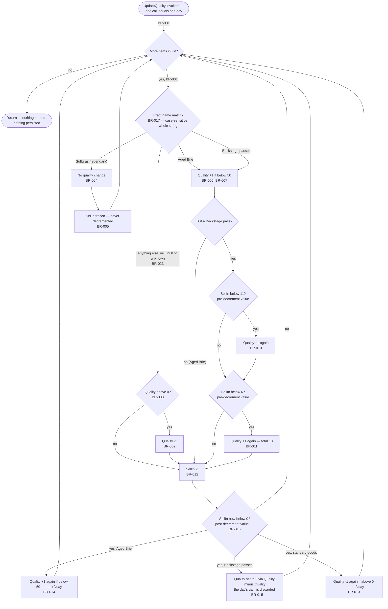
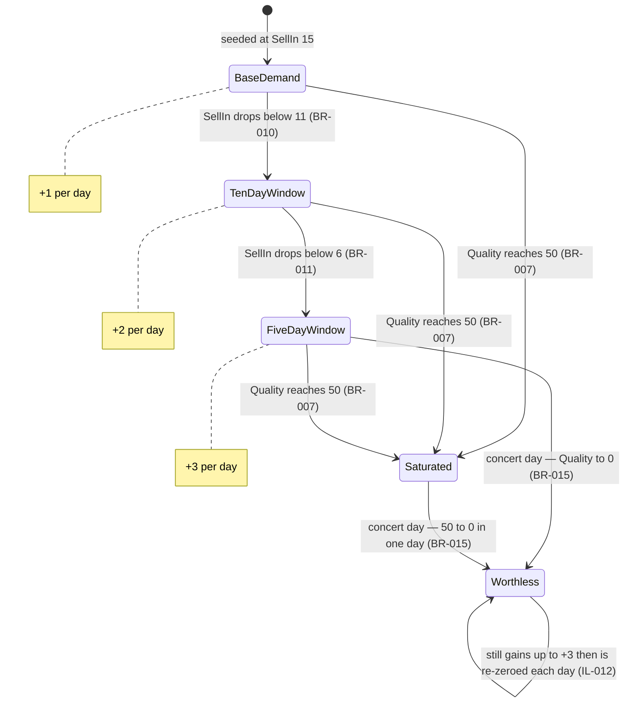
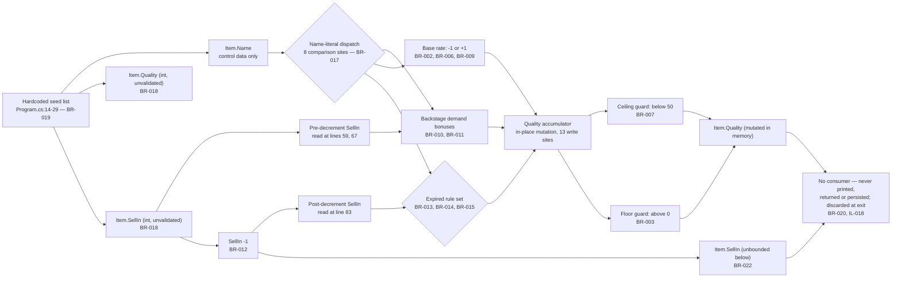

# Business Logic Report — Discovery Pass 2

**Application ID:** `d634afdb-97cc-4589-a080-5766d4f377d5`
**Application name (from staged catalog):** Gilded Rose Refactoring Kata
**Governing client profile:** `faa` (authoritative, per dispatch)
**Extraction date:** 2026-09-28
**Source root analysed:** `src/GildedRose.Console`, `src/GildedRose.Tests`

| Artifact | Contents |
|---|---|
| `business-logic.json` | 25 business rules with source traceability, dependencies and test hints |
| `state-machines.json` | 5 reconstructed state machines |
| `implicit-logic.json` | 27 implicit behaviours (magic numbers, magic strings, ordering dependencies, absent guards) |
| `business-logic.md` | This report |

---

## 1. Headline

**The entire business logic of this application is 75 lines long and lives in one method.**
`GildedRose.Console.Program.UpdateQuality()` at `src/GildedRose.Console/Program.cs:37-111` contains every
rule: validation, calculation, workflow and constraint. There is no database, no stored procedure, no
trigger, no service layer, no validation layer and no authorization layer anywhere in the application.

Three facts shape everything below:

1. **Nothing is declared.** Zero comments, zero named constants, zero configuration values. Every
   threshold — 50, 0, 11, 6, 80 — is an inline integer literal, and every business category is an inline
   string literal. The ratio of implicit to explicit logic (27 implicit behaviours against 25 rules) is
   the finding, not an artefact of over-reporting.
2. **Nothing is tested.** The one test method asserts `Assert.True(true)`
   (`src/GildedRose.Tests/TestAssemblyTests.cs:10`) and the test project holds no reference to the
   application. Behavioural coverage of all 25 rules is exactly zero, so no refactor is currently
   protected.
3. **One documented rule is simply not implemented.** See BR-MISSING-001 in §5.

---

## 2. Module map and rule distribution

Module identifiers below are keyed to `structural-analysis.json` `modules[].id` so downstream lines can join on them.

| Module | Path | LOC | Rules | Business-logic locus |
|---|---|---|---|---|
| `gildedrose-console` | `src/GildedRose.Console` | 160 | 25 | `Program.cs:37-111` (`UpdateQuality`, 75 lines) |
| `gildedrose-tests` | `src/GildedRose.Tests` | 12 | 0 | none — structurally disconnected from the application |

| By category | | By severity | | By complexity | |
|---|---|---|---|---|---|
| calculation | 10 | critical | 10 | extreme | 0 |
| constraint | 8 | standard | 14 | high | 1 |
| workflow | 4 | advisory | 1 | medium | 8 |
| validation | 2 | | | low | 16 |
| authorization | 1 | | | | |

Implicit rules: 9 of 25. Requiring SME review: 6 of 25.

**No rule was assigned `complexity: extreme`**, and therefore none carries `requires_sme_review: true` on
that basis. The threshold is cyclomatic complexity above 30 *within a single rule's implementation*, or a
rule touching more than three modules. `UpdateQuality` as a whole method measures cyclomatic ≈ 20 (19
decision predicates + 1, counted by this pass; no upstream artifact reported a figure) with a maximum
nesting depth of 5, but that complexity is the *sum* of 25 individually simple rules, and the application
has only one module containing logic at all. The highest single rule is BR-016 at `high`, flagged for SME
review on its own merits. Inflating individual rules to `extreme` to reflect a method-level score would
misdirect review effort away from BR-016 and BR-MISSING-001, which are where the risk actually is.

---

## 3. Regulatory coverage — **not applicable, determined rather than skipped**

`profiles/faa/compliance.yaml` declares five regulatory sources: 14 CFR Part 47 (Aircraft Registration),
Part 61 (Pilots/Instructors), Part 63 (Other Flight Crewmembers), Part 67 (Medical Standards) and
Part 183 (Representatives of the Administrator). The skill's trigger for bidirectional regulatory mapping
is a match between the application and a source's `applicable_systems` list. Those lists name the Civil
Aviation Registry, N-number assignment systems, IACRA, Airmen Certification databases, DMS, AMCS,
MedXPress, AME/Federal Air Surgeon systems, Aircraft Certification and ODA management.

**This application matches none of them.** Its rules revalue retail inn merchandise — cheese, concert
tickets, a legendary sword — against a sell-by counter. A repo-wide search found no aviation, NAS,
certification, airman, medical or registration concept anywhere in the tracked source.

Consequently:

- **Code → regulation mapping:** performed and returned no mappings. All 25 rules carry
  `implementation_fidelity: not_applicable` with a stated rationale, per the skill's instruction to
  distinguish non-regulatory logic explicitly rather than leaving it unmarked. "Unmapped" here means
  *checked and found non-regulatory*, not *not yet checked*.
- **Regulation → code mapping:** not performed, because no regulation in the profile governs this
  application's domain. **Zero `BR-MISSING-NNN` records were created for regulatory gaps.** Manufacturing
  gap records against Part 61 or Part 67 for an inn inventory system would fabricate a compliance risk
  that does not exist and would pollute the rationalization line's gap statistics.
- **Coverage statistics:** not computed. A percentage would imply a denominator this application does not have.
- **Drift list:** empty. **Contradiction list (CRITICAL):** empty — no code here can violate a regulation it does not implement.

The single `BR-MISSING-001` record in `business-logic.json` is a **documentation-to-code gap, not a
regulatory one**, and says so in its `regulatory_traceability.requirement_authority` field.

### Finding F-1 — governing-profile discrepancy (recorded, not adopted)

| | |
|---|---|
| **Severity** | High — blocks portfolio disposition, not this extraction |
| **Status** | Recorded for stakeholder ruling; profile `faa` retained as governing throughout |

The dispatch declares `faa` as the authoritative governing profile and this report is written under it.
The source tree, however, is the publicly published Gilded Rose Refactoring Kata (`README.md:1`, attributed
to @TerryHughes / @NotMyself at `https://github.com/NotMyself/GildedRose`) with no FAA content of any kind.
Two further observations, reported as facts about the artifact and **not** treated as competing profile
declarations:

- `src/GildedRose.Console/Properties/AssemblyInfo.cs:11,13` assert `AssemblyCompany("DSHS")` and
  `Copyright "DSHS 2015"` — a different agency attribution embedded in the shipped assembly metadata.
- `fixtures/default.json` in the source root self-identifies as a test fixture for the
  `compliance-citation-mapper` skill and describes a fabricated "legacy benefits-eligibility app" with
  citations to files (`src/eligibility/CustomerCertService.cs:142`, `src/eligibility/MedicalRules.cs:58`)
  that do not exist in this repository. It was **not** used as evidence. Note that the staged
  `catalog.json` `open_questions[1]` describes this file's contents differently (as an "ASP.NET WebForms
  4.8 / SQL Server 2016 system, ~68,400 LOC"); neither description matches the repo, and both Pass 1
  artifacts independently reject the file. Nothing downstream should cite it.

This extraction is unaffected: the rules below are read from the code as-built. What needs a stakeholder
ruling is whether `application_id d634afdb-97cc-4589-a080-5766d4f377d5` maps to a genuine FAA-owned
system before any disposition decision consumes this catalog.

---

## 4. Business process diagram

### 4.1 Daily revaluation — workflow and decision points

One invocation of `UpdateQuality` equals one business day (BR-020). Edges are labelled with the rule that
governs the transition.

**Read the diamond marked BR-016 carefully.** The two Backstage threshold tests read `SellIn` *before* the
`SellIn -1` node; the expiry diamond reads it *after*. That is the ordering dependency described in §5.

### 4.2 Backstage pass valuation — state machine

The self-loop on `Worthless` is real, not decorative: an expired pass is never removed from inventory, so
each subsequent day it climbs 0 → 3 and is reset to 0 by line 99. Net observable value stays 0, but any
re-implementation that logs, emits events or commits between phases would expose the intermediate.

The other four machines (`ItemSellByLifecycle`, `StandardGoodsValuationLifecycle`,
`AppreciatingGoodsValuationLifecycle`, `LegendaryItemStasis`) are in `state-machines.json`. None is
declared in the code — there is no status field, enum or state column anywhere — so all five are
reconstructed from the integer predicates the conditionals test, and each state is labelled with the
predicate that defines it.

### 4.3 Calculation chain — data flow

The single most important feature of this chain is its right-hand end: **the computed result has no
consumer.** The only console output in the application is the literal `"OMGHAI!"`, emitted *before* the
calculation runs.

### 4.4 Authorization decision tree — none exists

**No authorization diagram is produced, because there is no access-control logic to draw.** A repo-wide
search for `Authenticate`, `Login`, `Identity` and `Principal` across all tracked files returns nothing.
There is no user, role, permission, approval step or audit trail anywhere in the application. The
effective rule is recorded as BR-024: any in-assembly caller may revalue the entire inventory, with no
record of who changed what. The only access limit is accidental — `UpdateQuality` is `public` on the
`internal` class `Program` and reads a `private` field, so it is unreachable from outside the assembly
(IL-022), which is also why the test project cannot exercise it.

For the compliance line: the absence of NIST 800-53 AC-3 (Access Enforcement) and AU-2 / AU-12 (audit)
capability is a control-coverage observation for the security pass, not a business-rule-to-regulation mapping.

---

## 5. Findings requiring SME review

Six rules carry `requires_sme_review: true`. Four warrant escalation now.

### F-2 — BR-MISSING-001: a documented rule is not implemented, and stock is mispriced today

| | |
|---|---|
| **Severity** | Critical |
| **Fidelity** | `missing` (against business documentation, **not** against a regulation) |

`README.md:34` requires that *"Conjured" items degrade in Quality twice as fast as normal items*, and a
`"Conjured Mana Cake"` is seeded into the live inventory at `Program.cs:26`. The string `"Conjured"`
appears **nowhere** in `UpdateQuality` (`Program.cs:37-111`). The item is therefore priced as ordinary
standard goods — losing 1 per day instead of 2, and 2 per day instead of 4 after its sell-by date.

The business owner must rule on which of two readings is correct, because they lead to opposite downstream
actions:

- **Intended unfinished state** of a refactoring exercise → record as out of scope, and the current
  behaviour is the correct baseline.
- **Live defect** → the as-built behaviour must not be locked into a characterization test, and the
  modernized system must implement the doubled rate.

Implementation note for whoever fixes it: this would be the application's **first** multi-step
degradation, which breaks the assumption BR-003 silently relies on — that every decrement is exactly 1.
The zero floor must become a clamp rather than a `Quality > 0` guard, at two sites, or Quality 1 minus 2
will yield -1. The code also gives no answer to whether matching should be by `"Conjured"` prefix, by
substring, or by the exact name, and BR-017 shows there is no prefix-matching precedent anywhere.

### F-3 — BR-016: `SellIn` means two different things inside one iteration

| | |
|---|---|
| **Severity** | Critical — the highest re-implementation risk in the application |

The Backstage threshold tests at lines 59 and 67 read `SellIn` **before** the decrement at line 80; the
expiry test at line 83 reads it **after**. The literals 11 and 6 express the documented "10 days or less"
and "5 days or less" *only* under that ordering. Hoisting the decrement to the top of the loop — the most
natural cleanup a developer would make, and one that looks behaviour-preserving — silently shifts pricing
on the boundary days `SellIn` 11, 6 and 0. Nothing detects it: the only test asserts `Assert.True(true)`.

**Mandatory precondition for any work on this code: a golden-master test over the six seeded items across
at least 20 days, committed before the first edit.** Every rule in this catalog is currently unguarded
(IL-026).

### F-4 — BR-008 / IL-005: the application's own documentation is self-inconsistent

`README.md:23` states Quality is *never more than 50*. `README.md:44-45` states Sulfuras *is 80 and never
alters*. The code satisfies both by never applying the ceiling to legendary items: 80 is seeded at
`Program.cs:19` and never read by any rule, asserted, defaulted or restored. A value 30 above the
documented maximum persists indefinitely, and a mis-seeded legendary item would carry *any* value forever.

Needed from the owner: is the invariant "Quality ≤ 50 **for non-legendary items**", with legendary quality
a fixed 80 that the model should enforce? Any downstream consumer that assumes `[0, 50]` — a database
column, a UI gauge, a validation attribute — will be violated by legendary items on day one.

### F-5 — BR-020 / BR-023: operational semantics that cannot be inferred from code

- **No clock, no calendar, no idempotence (BR-020, IL-016, IL-017).** "A day" is defined as one call.
  Running twice advances two days, with no run-date record and no already-processed guard. Confirm whether
  a real inventory store exists outside this repository, because if it does, a retry after a partial
  failure would double-apply depreciation invisibly.
- **Unknown merchandise depreciates silently (BR-023, IL-021).** A null, empty or unrecognised `Name`
  raises no exception (C# string equality is null-safe), logs nothing, and falls through to standard-goods
  pricing. Confirm whether unknown items should default to depreciation or be rejected.
- **Unattended execution is impossible (BR-021).** `System.Console.ReadKey()` at `Program.cs:33` blocks
  until a keystroke. Under a scheduler or in a container, a nightly process would hang.

---

## 6. Implicit logic summary

Full detail in `implicit-logic.json` (27 entries). The distribution matters more than any single item:

| Kind | Entries | Examples |
|---|---|---|
| Magic numbers | IL-001 – IL-006 | 50 (4 sites), 0 (2 sites), 11, 6, 80, ±1 rate |
| Magic strings / dispatch | IL-007, IL-008 | Business taxonomy carried by 3 display-name literals across 8 sites; ordinal case-sensitive whole-string matching only |
| Ordering dependencies | IL-009 | `SellIn` read before and after its own decrement |
| Obfuscated idioms | IL-010 | `Quality = Quality - Quality` instead of `= 0` |
| Emergent rates and invariants | IL-011 – IL-015 | Brie's +2/day after expiry is stated nowhere; the legendary guard at line 91 is dead code *for the seeded data only* |
| Temporal semantics | IL-016 – IL-018 | No clock; non-idempotent; results never emitted |
| Type and range behaviour | IL-019 – IL-021 | `int` admits impossible values; `SellIn` unbounded below; null `Name` never throws |
| Structural / model gaps | IL-022 – IL-025, IL-027 | Rules unreachable outside the assembly; no quantity field; no audit trail; ~25 `Items[i]` access sites |
| Coverage | IL-026 | Zero behavioural test coverage of all 25 rules |

Two of these are worth singling out as traps for anyone re-implementing the system:

- **IL-003 / IL-004** — the literals 11 and 6 look like off-by-one bugs and are not. "Correcting" them to
  10 and 5 changes what the inn charges.
- **IL-015** — the Sulfuras guard at line 91 appears removable because the seeded data never reaches it.
  It is load-bearing for a Sulfuras seeded with a negative `SellIn`: whether the line is dead depends
  entirely on seed data, an invisible coupling between the rules engine and the item list.

---

## 7. Database business logic — none, measured rather than assumed

No business logic was extracted from a database tier **because the application has no database tier.**
This was verified independently by this pass and corroborated by four Pass 1 artifacts:

- Zero connection strings — `src/GildedRose.Console/app.config` contains only
  `<startup><supportedRuntime>` and declares no `<connectionStrings>` or `<appSettings>`.
- Zero DDL — no `*.sql` file is git-tracked.
- Zero ADO.NET/ORM usage in any of the four `.cs` files. The `System.Data` references at
  `GildedRose.Console.csproj:38,40` are default Visual Studio template references that no code consumes.
- The only application state is the in-memory `IList<Item>` at `Program.cs:7`, seeded from literals at
  `Program.cs:16-26` and discarded at process exit.

`db-archaeology.json` and `sqlserver-object-inventory.json` report all-empty inventories with an explicit
"NULL RESULT, not an unfinished walk" basis. **Carve-out:** `scripts/classify_procs_template.sql` exists
in the source root but is untracked Discovery-skill template material whose every statement is commented
out; it is not this application's DDL and was not read as evidence of a schema.

---

## 8. Method, scope and limits

**Scope decision.** The skill directs sub-agent decomposition for codebases above ~5 modules or ~2000 LOC
and a single pass where that is clearly cheaper. This application is 172 LOC across 4 `.cs` files in 2
modules, all logic in one 75-line method, so the rules were extracted in a single pass over the full
source. Two sub-agents were used for *verification* rather than extraction, in parallel: one swept every
non-`src/` file for application logic, one digested the six staged Pass 1 artifacts.

**What the verification sweep established.** `git ls-files` returns exactly 22 tracked files. The
directories `assets/`, `fixtures/`, `references/`, `schemas/` and `scripts/` are all **untracked** —
Olympus/Discovery skill material injected into the working tree, not part of the application. A repo-wide
grep for `Sulfuras|Aged Brie|Backstage|Conjured|SellIn|UpdateQuality|Quality` outside `Program.cs` returns
only README prose and project-name strings. `build.bat` and `tasks.ps1` contain tooling preconditions
(PowerShell version 3 check, NuGet bootstrap) with no business meaning. Both `AssemblyInfo.cs` files are
metadata only, and the Tests one is empty. All four `.cs` files are accounted for in the two `.csproj`
`<Compile Include=…>` groups, so the compiled surface is fully covered.

**Known limits.**

- `packages/` is unrestored, so the bodies of the psake tasks imported at `tasks.ps1:11` were not read.
  They orchestrate build and test steps, not business rules.
- No cyclomatic-complexity figure exists in any upstream artifact; the ≈ 20 in §2 was counted by this pass
  and its basis is recorded in `business-logic.json` `module_summary`.
- Rule severity and category assignments are this pass's judgement from code behaviour; the application
  has no comments or specification beyond `README.md` to corroborate intent.
- Whether the real production system persists this inventory somewhere outside this repository is
  unresolved (F-5). If it does, that store is invisible to this walk.

---

## 9. Handoff

| Consumer | What to take |
|---|---|
| Modernization / Extract | All 25 rules with `source_traceability`. Start with F-3: commit a golden-master test over the six seeded items before any transformation. Do not lock in BR-MISSING-001's current behaviour until F-2 is ruled on. |
| Rationalization | `business-logic.json` `totals` and `module_summary`. Note F-1: disposition depends on resolving whether this `application_id` maps to a real FAA system. |
| Compliance / security | No regulatory mapping applies (§3). BR-024 and IL-025 are the AC-3 / AU-2 / AU-12 control-coverage inputs. |
| SRS / design | `state-machines.json` — five machines that must become explicit state in any target design, since none is declared in the source today. |
