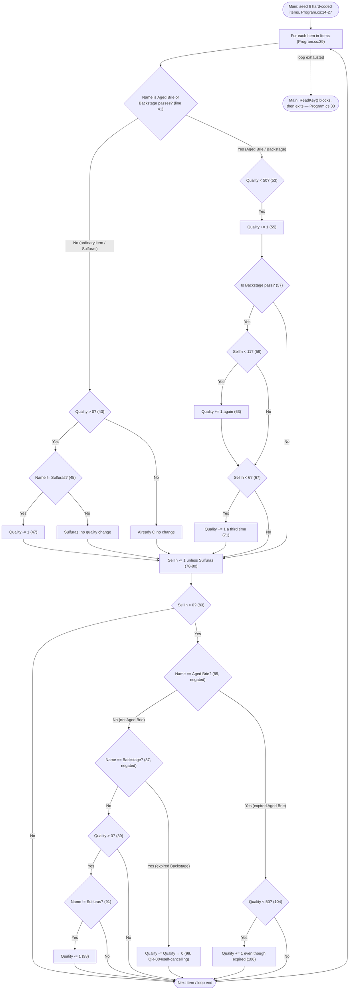

# Quality & Risk Assessment — Gilded Rose Refactoring Kata

**Application ID:** `d634afdb-97cc-4589-a080-5766d4f377d5`
**Assessment pass:** Discovery Pass 3 — quality-risk-assessor
**Assessment date:** 2026-09-28
**Structural map source:** `discovery-structural-analysis/structural-analysis.json` (Discovery Pass 1 — legacy-architecture-mapper)
**Governing profile:** `faa` (authoritative per this task's binding declaration)

---

## 0. Governing-profile / application-identity discrepancy (recorded, not adopted)

This assessment is required to run under the FAA profile, and every scoring lens
below (`profiles/faa/scoring.yaml`, `profiles/faa/risk-classification.yaml`) is
applied on that basis, as instructed. Separately — as a factual observation, not
a contradiction of the governing-profile declaration — the source tree itself is
the publicly published, generic **"Gilded Rose Refactoring Kata"** (a retail-inn
inventory exercise; see `README.md:1` and its attribution to @TerryHughes /
@NotMyself). It contains no aviation, NAS, certification, or FAA business
content of any kind. Pass 1 additionally observed (`structural-analysis.json`,
`open_questions[0]`) a *third*, internally conflicting attribution baked into
the shipped assembly metadata itself:
`AssemblyInfo.cs:11,13` asserts `AssemblyCompany("DSHS")` / `Copyright "DSHS 2015"`.

None of the three signals (FAA governing declaration, generic kata content,
DSHS assembly metadata) is treated here as authoritative over the others — the
FAA declaration governs *this task's execution*, per instruction, but whether
application_id `d634afdb-97cc-4589-a080-5766d4f377d5` actually maps to a real
FAA-owned system remains **unconfirmed** and is carried forward as the single
largest source of uncertainty in this report. Every FAA-specific weighting,
baseline, and tier used below should be re-validated once that mapping is
confirmed by a stakeholder.

---

## 1. Risk summary

**Overall risk tier: HIGH**

This reflects a combination of proven zero test coverage, a single
untestable/unseamed business-rules method carrying all the application's
logic, an end-of-support runtime with no in-place path to the FAA target
substrate, and a non-hermetic, internet-dependent build chain. It is **not**
rated CRITICAL: no confirmed exploitable vulnerability exists (none could be
confirmed — see §3), no PII/financial/safety-critical code path was found in
the application (see §5), and the repository shows no evidence of high-churn
active production use that would compound the zero-coverage risk (see §2's
technical-debt discussion of the single-commit history).

**Top risk drivers** (see `risk_summary.top_risk_drivers` in `quality-risk.json`
for the machine-readable list):
1. Zero executable test coverage over the entire business-rules engine — proven structurally, not estimated.
2. `UpdateQuality` (`Program.cs:37-111`) is a 75-line, 5-deep-nested, 8-way magic-string-dispatch method with duplicated logic blocks and no seam for testing or safe modification.
3. Both projects target .NET Framework 4.5 / 4.5.1, past Microsoft end-of-support, with no in-place path onto the FAA profile's AWS GovCloud / Amazon ECS-on-Fargate substrate.
4. The build chain is non-hermetic: an unpinned NuGet.exe download over the public internet, a deprecated nuget.org v2 feed, and task bodies (`tasks.ps1:11`) supplied by an out-of-repo `psake.net` package not present in this workspace.
5. No SCA/vulnerability-database output was available as an input — the dependency graph is **unassessed**, not clean (§3).
6. The governing-profile/application-identity discrepancy in §0.

**Highest-risk modules** (the portfolio has exactly two; both are named per the
skill's requirement to call out the highest-risk modules explicitly):

| Module | Why it's highest-risk |
|---|---|
| `gildedrose-console` | The entire application (160 of 172 LOC): entry point, seed data, complete rules engine, and domain model in one file/class/namespace, at 0% proven coverage, on an EOL runtime. |
| `gildedrose-tests` | Structurally disconnected from production code (zero `<ProjectReference>`, one tautological `Assert.True(true)`) — its risk is the *false impression* of a safety net where none exists. |

**Regulatory surface flags:** none. No PII, financial-calculation, or
safety-critical code path was found anywhere in this 172-line, database-free,
integration-free console application (confirmed by Pass 1's exhaustive grep
for connection strings, HTTP/SOAP/WCF clients, and identity/auth markers, all
returning zero matches). This is independent of the §0 identity question —
even if the application_id is confirmed as FAA-owned, the *code as it exists
today* touches none of those categories.

---

## 2. Technical debt

**Score: 76 / 100 — band: HIGH**

The rubric (`debt = weighted_sum(smell_density, coverage_gap, vuln_count,
churn_rate)`) requires two of its four inputs to be marked **unavailable**
rather than measured:

| Input | Value | Status |
|---|---|---|
| `smell_density` | 72/100 | Measured — see below |
| `coverage_gap` | 80/100 | Measured — see §4 |
| `vuln_count` | — | **Unavailable.** No SCA/vulnerability-database tool output was supplied as an input to this assessment (see §3). Excluding it from the sum, rather than defaulting it to 0, avoids reporting an unknown as a clean result. |
| `churn_rate` | — | **Unavailable.** The repository's entire history is one commit ("Update README.md", no remote configured — `structural-analysis.json` `open_questions[6]`), which cannot support a commits/quarter figure in either direction. |

With two inputs unavailable, their combined default weight (0.30 of 1.0) is
redistributed proportionally across the two measured inputs:

- Default full-input weights: `smell_density 0.35, coverage_gap 0.35, vuln_count 0.15, churn_rate 0.15`
- Redistributed weights actually used: `smell_density 0.50, coverage_gap 0.50`

**smell_density derivation:** 18 weighted code-smell occurrences (the sum of
`count` across `QR-001`–`QR-008` in §5) inside a 160-LOC module. Normalized as
`round(100 * 18 / 25) = 72`, where 25 was chosen as the saturation point
because a per-KLOC formula is unstable at this module's size (a per-KLOC
computation on 160 LOC would produce a triple-digit density purely from the
small denominator, which would overstate the finding rather than describe
it — this constant is an assessor judgment call, stated here so a reviewer can
substitute their own and rerun the arithmetic).

**Score formula:** `round(0.50 * 72 + 0.50 * 80) = 76`

**Band thresholds** (assessor-defined default; no FAA-profile-specific debt
bands were found in `profiles/faa/scoring.yaml` or
`profiles/faa/risk-classification.yaml`): 0–25 low, 26–50 moderate, 51–80
high, 81–100 critical. 76 falls in the **high** band, just below critical.

**Per-module:** all measured debt is attributed to `gildedrose-console` (score
76, band high) since it is effectively the whole application. `gildedrose-tests`
is not independently scored — its condition (zero production coupling) is
already captured as the coverage gap on `gildedrose-console`, and double-counting
it as a second debt score would inflate the picture without adding information.

---

## 3. Vulnerabilities

**No vulnerability records are reported. This is a measurement gap, not a
clean result — do not read the empty list in `quality-risk.json` as "no
vulnerabilities exist."**

No SCA tool output, dependency-vulnerability database, or SBOM was supplied as
an input to this assessment, and per this skill's constraints, CVE records
must not be synthesized without an authoritative source. What can be said from
the manifests directly read (`packages.config` × 3):

| Package | Version | Where |
|---|---|---|
| GitVersionTask | 2.0.1 | `src/GildedRose.Console/packages.config:3` (declared, not imported — dead) |
| GitVersionTask | 3.4.1 | `src/GildedRose.Tests/packages.config:3` |
| xunit / xunit.abstractions / xunit.assert / xunit.core / xunit.extensibility.core / xunit.runner.visualstudio | 2.0.0 | `src/GildedRose.Tests/packages.config:4-8` |
| GitVersion.CommandLine | 2.0.0 | `.nuget/packages.config:3` |
| NUnit.Runners | 2.6.4 | `.nuget/packages.config:4` (dead — no NUnit reference exists in either project) |
| psake / psake.net | 4.4.1 / 0.1.3 | `.nuget/packages.config:5-6` |

All of these are roughly a decade old as of this assessment date. That is a
**currency** observation (feeding `dependency-currency` in
`profiles/faa/scoring.yaml`), not a vulnerability finding — asserting a CVE
against any of them without a scanner or advisory feed would be exactly the
fabrication this skill is required not to do.

One related but distinct platform-lifecycle fact, **not** recorded as a CVE:
both projects target .NET Framework 4.5 / 4.5.1, which is past Microsoft's
published end-of-support date (structural-analysis.json,
`primary_technology.runtimes`). This is carried in §1's risk drivers as a
lifecycle/support risk, separate from the vulnerability gap, per this skill's
instruction to keep debt/vuln/lifecycle concerns distinguishable rather than
merged into one number.

**Action needed to close this gap:** run the client's SCA tool of record
against the resolved dependency graph (this requires restoring `packages/`,
which is absent from this workspace — see structural-analysis.json's own
"what the walk could not reach" note) and re-run this assessment.

---

## 4. Test coverage

**Line coverage: 0%. Branch coverage: 0%. Gap to baseline: 80 percentage points.**

This is a **structurally proven zero**, not an assumed or defaulted one, and
not a case of "measurement unavailable" either — the two must be kept
distinct per this skill's constraints:

- No coverage tool or CI-emitted coverage report exists for this application
  (`structural-analysis.json` records `primary_technology.ci_cd: []`, and no
  CI/CD config file of any kind is present in the repository).
- Direct inspection confirms `src/GildedRose.Tests/GildedRose.Tests.csproj`
  (lines 42-58) declares **no** `<ProjectReference>` to `GildedRose.Console`,
  matching Pass 1's repo-wide grep for `ProjectReference`, which returned zero
  matches anywhere in the tree.
- The one test method that exists,
  `src/GildedRose.Tests/TestAssemblyTests.cs:7-11`
  (`public void TestTheTruth() { Assert.True(true); }`), asserts a tautology
  and calls no production type or method.

Because the test assembly holds no reference edge to the production assembly,
it is **mechanically incapable** of executing any statement inside
`Program.cs`, regardless of what any individual test asserts. Line and branch
coverage of `gildedrose-console` are therefore 0% by construction — a provable
fact from the dependency graph, not an estimate.

**Baseline:** the skill's stated 80% default was used because this
application's NAS-safety tier is unconfirmed (`application-catalog-entry.md`:
`safety_tier: null`, with an explicit open question directing this to Safety
Board confirmation per `profiles/faa/risk-classification.yaml`'s override
rules). If a tier is later confirmed, re-run this section against the
tier-specific baseline (`test_coverage_overall`: 0.90 for Tier 1, 0.80 for
Tier 2/3 in that file) — for this application the number would not change
(0% either way), but the *gap* framing would.

**Legitimately untestable vs. untested first-party code:** there is no
generated or vendored code in this repository to exclude from the figure —
all 172 LOC are first-party, hand-authored, and all of it is currently
untested. There is nothing here to carve out as "legitimately untestable."

---

## 5. Code smells (file:line traceability)

All 8 findings below live in the single module `gildedrose-console`
(`src/GildedRose.Console/Program.cs`). IDs match `quality-risk.json`
`code_smells[].id`.

| ID | Kind | Count | Evidence (file:line) | Description |
|---|---|---|---|---|
| QR-001 | long-method | 1 | `Program.cs:37-111` | `UpdateQuality` is 75 lines — the entire business-logic surface of the application in one method. |
| QR-002 | god-class | 1 | `Program.cs:5-122` | `Program` hosts the process entry point (`Main`), the complete rules engine (`UpdateQuality`), and (via shared file/namespace) the domain model `Item` — no layering exists to separate these responsibilities. |
| QR-003 | deep-nesting | 1 | `Program.cs:83-95` | Reaches 5 levels of nested conditionals (`SellIn<0` → 3 negated name comparisons → `Quality>0` → a 4th name comparison) inside the per-item loop. |
| QR-004 | duplicated-code | 4 | `Program.cs:53-55`, `61-64`, `69-72`, `104-107` | The identical block `if (Items[i].Quality < 50) { Items[i].Quality = Items[i].Quality + 1; }` (or its structural twin) is repeated 4 times rather than factored into one guarded increment helper. |
| QR-005 | magic-string-dispatch | 8 | `Program.cs:41`, `45`, `57`, `78`, `85`, `87`, `91`, and the `else`-implied comparison at `51` | Every rule branch is selected by comparing `Item.Name` against a literal string (`"Aged Brie"`, `"Sulfuras, Hand of Ragnaros"`, `"Backstage passes to a TAFKAL80ETC concert"`) — 8 comparisons total, case- and whitespace-sensitive, with no enum, subtype, or lookup table. |
| QR-006 | cyclomatic-complexity-hotspot | 1 | `Program.cs:37-111` | `UpdateQuality` carries roughly 16 independent `if` decision points (≈17 cyclomatic complexity) concentrated in one method — well under the escalation threshold of 50 (see §6), but a clear hotspot relative to the file's 124 total lines. |
| QR-007 | dead-code | 1 | `Program.cs:8` | The `string[] args` parameter of `Main` is declared but never read; the executable accepts no invocation-time configuration despite appearing to. |
| QR-008 | unguarded-invariants | 1 | `Program.cs:117-121` (public setters), enforced only at `47`, `80`, `117-121` | `Item.Quality`/`SellIn`/`Name` have public, unguarded setters; the documented invariants (quality never negative, never above 50, Sulfuras fixed at 80) are enforced nowhere but inside the single `UpdateQuality` loop, so any second writer could violate them undetectably. |

**These are maintainability/design findings, not defects.** None of QR-001
through QR-008 describes a runtime failure the application exhibits today —
each is a cost driver for the *next* person who has to read, test, or change
this code, which is the distinction this skill's methodology requires keeping
explicit.

One additional non-code, build-toolchain observation worth carrying alongside
these (not counted in the `code_smells` array or the debt score, because it is
a build/dependency-hygiene issue rather than a source-code pattern): three
dead or unused package references exist across the two `packages.config`
files — `NUnit.Runners 2.6.4` (`.nuget/packages.config:4`, no NUnit reference
anywhere), `GitVersionTask 2.0.1` (`src/GildedRose.Console/packages.config:3`,
declared but never imported), and four unused BCL references
(`System.Data`, `System.Data.DataSetExtensions`, `System.Xml`,
`System.Xml.Linq` — `GildedRose.Console.csproj:37-41`, Visual-Studio template
defaults with no matching `using` anywhere in `Program.cs`).

---

## 6. Complexity escalation disposition

Each threshold in the skill's escalation table was checked explicitly against
this application's two modules. **None was exceeded, so no
`escalation-record.json` is produced by this pass.**

| Metric | Threshold | Actual (gildedrose-console) | Actual (gildedrose-tests) | Triggered? |
|---|---|---|---|---|
| Cyclomatic complexity (per method) | > 50 | ≈17 (`UpdateQuality`, `Program.cs:37-111`) | 1 (`TestTheTruth`, trivial) | No |
| Afferent coupling (per module) | > 8 | 0 — no other module in this 2-module solution depends on `gildedrose-console` (`internal_dependencies: []` in structural-analysis.json) | 0 | No |
| Fan-in / fan-out ratio | > 5:1 | Not applicable — zero internal edges exist between the two modules in either direction | Not applicable | No |
| Regulatory surface area (PII / financial / safety-critical) | any | None found — see §1 regulatory_surface_flags | None found | No |
| Zero coverage + high churn (>20 commits/quarter) | both | Coverage is 0% (§4), but churn is unmeasurable/effectively nil — the repository holds a single commit total, not a high-churn history | Coverage n/a (test scaffold) | No |

**Module X: complexity within acceptable bounds (cyclomatic max: ≈17, coupling:
0 afferent / not applicable fan-in:fan-out, no regulatory surface) —**
applies to both `gildedrose-console` and `gildedrose-tests`. This is stated
explicitly, as required, so the absence of an escalation is an auditable
decision rather than a silent omission. Note that "acceptable bounds" here is
strictly about the five listed metrics — it does not soften §1's overall HIGH
risk tier, which rests on the coverage/coupling/lifecycle/build findings
above, none of which map onto this specific escalation table.

The §0 governing-profile/application-identity discrepancy is *not* treated as
a complexity-escalation trigger (it isn't one of the five listed metrics) and
therefore does not produce an `escalation-record.json` from this skill either;
it is carried forward as a top-level risk driver and narrative caveat instead,
per this task's instruction to record rather than silently adopt or discard it.

---

## 7. Business process context

The skill calls for a Mermaid diagram for any module that either exceeds an
escalation threshold or contains workflow/state-machine logic. No threshold
was exceeded (§6), but `UpdateQuality` is the application's one piece of
branching business logic, so its decision flow is included below to help a
reviewer see the full blast radius of the QR-001–QR-008 findings in one place.
There is no larger cross-application process to show: this console run has no
callers, no downstream consumers, zero integration points, and zero persisted
state (`structural-analysis.json` `integration_points: []`), so the diagram
below **is** the entire business process, start to finish, for one item in
the nightly run.

Reading this diagram against §5: QR-003 (deep-nesting) is the `Expired` branch
chain on the right; QR-004 (duplicated-code) is the three `Quality < 50 →
Quality += 1` diamonds that recur on the left and again inside `BrieIncCheck`;
QR-005 (magic-string-dispatch) is every diamond that tests `Name ==`/`!=` a
literal. There is no second module, workflow step, or external system for
this process to hand off to — the entire "business process" begins and ends
inside this one loop, once per process invocation.

---

## 8. Summary for downstream consumption

- **Rationalization scoring pipeline:** `technical_debt_score.score = 76`
  (band: high) and `test_coverage.overall = 0` feed `operational_readiness`;
  `vulnerabilities = []` with `measurement.method = unavailable` per finding
  category feeds `security_readiness` — downstream scoring MUST treat the
  empty vulnerability list as an open measurement, not evidence of a clean
  security posture.
- **G-DC card:** overall risk tier HIGH, driven by proven zero coverage, an
  unseamed 75-line rules engine, an EOL runtime, and a non-hermetic build —
  compounded by the unresolved application-identity question in §0, which a
  reviewer should resolve before treating any FAA-specific weighting applied
  here as final.
- **No escalation record was produced by this pass** (§6) — all five
  complexity-escalation metrics fell within bounds.
