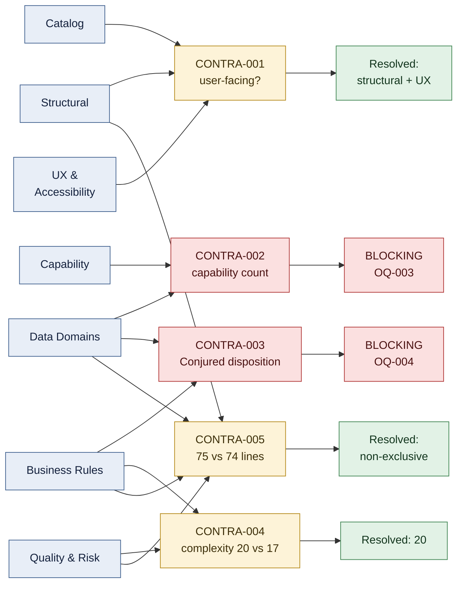
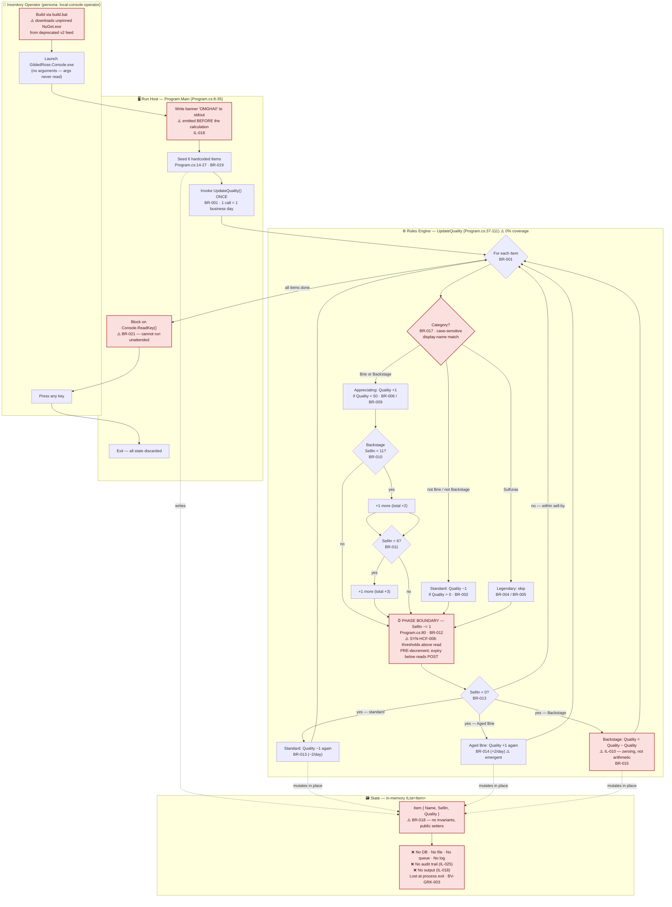
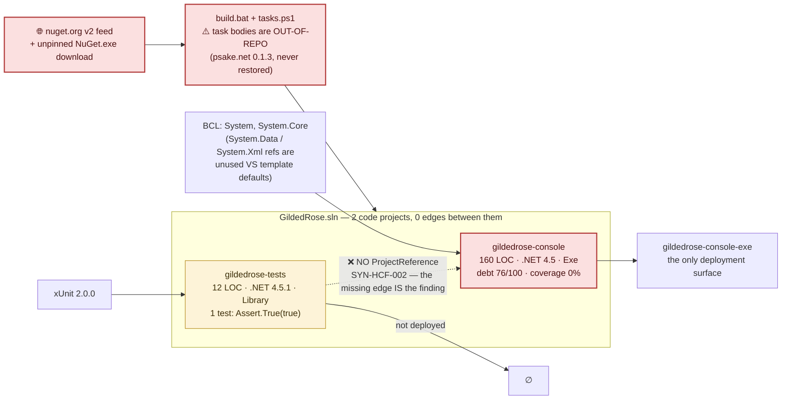
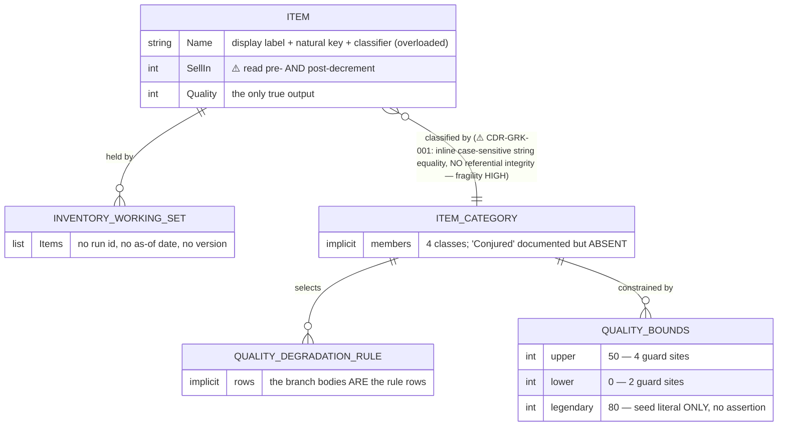

# Discovery Synthesis — Gilded Rose Refactoring Kata

**Application ID:** `d634afdb-97cc-4589-a080-5766d4f377d5`
**Governing client profile:** `faa` (authoritative, declared by the application record)
**Synthesis date:** 2026-09-28
**Gate:** G-DC (Discovery Complete) — review package

---

## ⚠️ Read this first: the analysis target is unconfirmed

All eight substantive Discovery passes, working independently, reached the same observation
about the *subject* of this analysis rather than about its contents:

> The source tree carries no aviation, NAS, certification or FAA business content of any
> kind. It is the publicly published, MIT-licensed **Gilded Rose Refactoring Kata** — a
> 172-line C# console exercise modelling a fictional inn's nightly stock revaluation.
> Its shipped assembly metadata (`AssemblyInfo.cs:11`, `:13`) asserts a **third**
> attribution: `AssemblyCompany("DSHS")`, `Copyright "DSHS 2015"`.

The declared `faa` binding **wins**, and no value in any artifact was changed to match the
code's apparent origin. The discrepancy is recorded as finding **SYN-HCF-001** and routed as
the leading review ask, `analysis-scope-unconfirmed`.

This ask ranks first for a measured reason: **if the analysis target is wrong then every
artifact in this package is scoped wrong while each one remains internally consistent** — so
an automated pre-review will still score the package highly and the error passes the gate
undetected. Every persona, adoption, capability, domain-boundary and criticality judgement
below is conditional on it.

---

## 1. Input completeness

Ten Discovery passes were expected and **ten were present**. There are no
`absent_expected` and no `na_by_subject` rows — which is itself a finding worth stating
plainly, because a reviewer should not have to infer completeness from silence.

| Canonical pass | Status | Artifact | Note |
|---|---|---|---|
| Catalog | ✅ present | `catalog.json` | Supplied `complexity_tier: "simple"`, echoed verbatim into `business-criticality.json` and **not** recomputed. |
| Structural | ✅ present | `structural-analysis.json` | Consumed with its embedded `database-schema-summary` and `interface-inventory`, plus seven staged sub-artifacts (call-graph, data-flow-trace, db-archaeology, identity-landscape, language-detection, sqlserver-object-inventory, tiff-corpus-assessment). **This is the module spine every other pass is joined onto.** |
| Structural specialist (.NET) | ✅ present | `dotnet-fingerprint.json` | The tech-stack specialist selected by the C#/.NET fingerprint. |
| Business rules | ✅ present | `business-logic.json` | 25 rules (BR-001..BR-024 + BR-MISSING-001), plus `state-machines.json` (5) and `implicit-logic.json` (27). **Not delivered paged** — no index or per-module slices were staged, so the whole document was read and all 25 rules reconciled against `totals.total_rules`. |
| Quality & risk | ✅ present | `quality-risk.json` | Plus `escalation-record.json` (ESC-001). **Partial by its own declaration**: 2 of 4 debt-rubric inputs were unmeasurable and were *excluded rather than zero-defaulted*. |
| UX & accessibility | ✅ present | `ux-accessibility.json` | **Present but incomplete by its own declaration**: the accessibility-checker sub-skill could not be composed because its Sub-Skill Output Contract was absent from that dispatch. Empty findings = *no checker ran*, not zero defects. Caps SYN-MCF-005 at medium. |
| Data domains | ✅ present | `data-domains.json` | 2 domains, 5 logical entities, 3 arbitrations, 4 carried-forward boundary violations. |
| Shared database | ✅ present | `shared-db-analysis.json` | Plus `decomposition-strategy.json`. Measured negative result, re-derived first-hand rather than inherited. |
| Capability | ✅ present | `capability-catalog.json` | **Present but built from an incomplete input set**: the pass records that `data-domains.json` — its own strongest signal — was absent from its dispatch. That artifact *is* present here, so the corroboration it could not perform is performed in **CONTRA-002**. |
| Compliance citations | ✅ present | `compliance-citations.json` | Profile-declared additional pass. Zero citations across 22 tracked files. |

**Two dimensions are honestly unmeasured** and are labelled as gaps, not clean results:

- **Dependency vulnerabilities** — 12 NuGet packages, several pinned to 2014-era versions, were
  never scanned. No SCA tool output was supplied. *This is not "no vulnerabilities found."*
- **Accessibility** — no checker ran, and whether Section 508 / WCAG 2.1 AA even *applies* to a
  character-mode console surface is unruled. `gate_decision: "undetermined"`.

---

## 2. What this system is, in one screen

| Dimension | Measurement |
|---|---|
| Archetype | `cli` — single-assembly console monolith, no tiers, no process boundaries |
| Size | 172 LOC C#, 22 git-tracked files, 2 modules, 4 `.cs` files, 3 classes, 3 methods |
| Business logic | **One 75-line method**, `Program.cs:37-111`, holding 100% of the rules |
| Rules | 25 extracted — 10 critical, 14 standard, 1 advisory; **9 implicit**; 0 mapped to any regulation |
| Interfaces | 1 total, 1 human-facing, **0 machine-facing** |
| Endpoints / integrations | 0 HTTP, 0 SOAP, 0 queues, 0 scheduled jobs, 0 integration points |
| Data | **0 tables, 0 connection strings, 0 persistence.** All state is an in-memory `IList<Item>` |
| Identity | **None.** No user, role, session, credential or IdP. `nist_aal: below-AAL1` |
| Tests | 1 test method, **0 exercising business logic**; coverage 0% *by structural proof* |
| Runtime | .NET Framework 4.5 / 4.5.1 — Windows-only, past end of support |
| Complexity tier *(catalog)* | `simple` |
| Technical risk tier *(quality-risk)* | **HIGH** |
| Business criticality | **Not rated — `insufficient_evidence`** (see §6) |

> **The `simple` / `HIGH` pairing is not a contradiction.** They are orthogonal axes and this
> synthesis never combines them: *simple* is how much there is, *HIGH* is how dangerous it is
> to change. Criticality — what breaks if it stops — is a third, independent axis, and it is
> the one we declined to guess.

---

## 3. Consolidated findings

25 findings: **12 high**, **8 medium**, **5 low**. **22 are flagged
`architecturally_significant: true`** and form the ADR-coverage denominator for the
Architecture line.

That 22/25 ratio is high, and it is a property of the subject rather than loose flagging: for
this application almost every finding is a *"the target must **add** this"* finding —
persistence, egress, audit, identity, observability, a test seam, a category identifier,
explicit lifecycle states — rather than a *"the target must **preserve** this"* finding. The
three deliberately **not** flagged are `SYN-MCF-001` (the debt score — a scoring input),
`SYN-MCF-007` (the pipeline staging defect — a platform concern) and `SYN-LCF-003` (the
inferred persona — an unevidenced population estimate).

### The four findings that shape everything else

1. **There is no seam** (`SYN-HCF-004`). One 124-line file holds the entry point, the seed
   data, the complete rules engine and the domain model in one class and namespace — and
   `UpdateQuality` is an instance method on the **internal** class `Program` reading the
   **private** field `Items`. Its effective accessibility is assembly-internal and it takes no
   parameters. Nothing outside the assembly can call it.

2. **Coverage is a provable zero** (`SYN-HCF-002`) — and it is a *consequence* of finding 1.
   `GildedRose.Tests.csproj` declares no `<ProjectReference>` to `GildedRose.Console`, and the
   one test asserts `Assert.True(true)`. The regression net for a 75-line rules engine is
   *structurally absent, not merely thin*. Worse than absent: a reader who counts two projects
   and an xUnit reference would reasonably assume coverage exists.

3. **There is nothing to migrate** (`SYN-HCF-003`, `SYN-HCF-012`). No database, file, queue or
   blob. The only console write is the literal `"OMGHAI!"` — emitted *before* the calculation
   runs. No computed value is ever printed, returned, logged or persisted. The nightly
   revaluation's business output is, today, **unobservable**.

4. **The subject itself is in doubt** (`SYN-HCF-001`). See the banner above.

### High-confidence findings (12)

| ID | Finding | Passes |
|---|---|---|
| SYN-HCF-001 | Governing-profile / application-identity discrepancy; no FAA content; conflicting `DSHS` attribution | all 9 |
| SYN-HCF-002 | Zero test coverage, structurally proven (no `ProjectReference`) | 5 |
| SYN-HCF-003 | No database, no persistence; in-memory list discarded at exit | 5 |
| SYN-HCF-004 | No seam: rules engine assembly-internal, unreachable, unparameterised | 4 |
| SYN-HCF-005 | Business taxonomy carried by case-sensitive display-name equality at 8 sites | 3 |
| SYN-HCF-006 | EOL Windows-only runtime + blocking keypress; no in-place path to substrate | 3 |
| SYN-HCF-007 | Revaluation unauthenticated and unaudited; no identity concept at all | 5 |
| SYN-HCF-008 | `SellIn` means two different things in one iteration; literals 11 and 6 are order-dependent | 3 |
| SYN-HCF-009 | Non-hermetic, internet-dependent build chain; supply-chain exposure | 2 |
| SYN-HCF-010 | Documented `Conjured` rule has no implementation; item mispriced every run | 4 |
| SYN-HCF-011 | No regulatory, compliance or sensitive-data surface (measured null) | 5 |
| SYN-HCF-012 | Computed results never emitted anywhere; output unobservable | 2 |

### Medium (8) and low (5)

Medium: debt score 76/100 from 2-of-4 inputs (`SYN-MCF-001`) · 12 dependencies **unassessed**
for CVEs (`SYN-MCF-002`) · two candidate data domains, none persistent (`SYN-MCF-003`) · five
state machines *reconstructed*, none declared (`SYN-MCF-004`) · accessibility **undetermined**,
not compliant (`SYN-MCF-005`) · zero instrumentation ≠ zero usage (`SYN-MCF-006`) · pipeline
input-staging defect across ≥3 passes (`SYN-MCF-007`) · legendary Quality 80 exists only as
seed data, 30 above the documented max (`SYN-MCF-008`).

Low — **retained deliberately as known-unknowns, not oversights**: the single 0.4-confidence
capability (`SYN-LCF-001`) · rule-set domain vs. behaviour, *blocking* (`SYN-LCF-002`) · the
inferred single persona at 0.3 (`SYN-LCF-003`) · possible out-of-repository data store
(`SYN-LCF-004`) · port vs. retire/replace unresolved (`SYN-LCF-005`).

---

## 4. Cross-pass contradictions

Five genuine disagreements. **Both claims are preserved in every case**; where neither side
dominates, no winner was picked.

| ID | Topic | Reconciliation |
|---|---|---|
| **CONTRA-001** | Is the app user-facing? Catalog says `false`; structural + UX record 1 human-facing surface with a named persona | **Resolved toward structural + UX** (2 passes, same source line). Both retained — a 508 obligation attaches to one reading, adoption scoring to the other. → OQ-002 |
| **CONTRA-002** | How many capabilities? Capability pass: 1 at 0.4 (ran *without* `data-domains.json`). Data-domains: a second separable merchandising-policy domain at 0.58 | **Not reconciled — blocking.** The corroboration the capability pass couldn't do *is* done here: the catalog is now known **under-specified**, not merely low-confidence. → OQ-003 |
| **CONTRA-003** | Is the unimplemented `Conjured` rule a live defect or stale documentation? Business-rules: **critical**, "mispriced today, on every run". Data-domains: **medium**, "treat the code, not the README, as as-built" | **Not reconciled — blocking.** The passes agree on every *fact* and disagree on *disposition*, which is a question about intent no static evidence settles. → OQ-004 |
| **CONTRA-004** | Cyclomatic complexity of `UpdateQuality`: **20** (business-rules, 19 predicates enumerated line-by-line) vs **~17** (quality-risk escalation record) | **Resolved toward 20** — enumerated and checkable, vs. an approximation with no stated basis. Changes no disposition (both ≪ the >50 threshold) but the SRS and any sizing must cite one figure. |
| **CONTRA-005** | Method extent: **75 lines / `Program.cs:37-111`** (3 passes) vs **74 lines / `:39-110`** (data-domains) | **Non-exclusive.** 37-111 is the method; 39-110 is the loop body; 41-109 the rule block. Recorded because extraction cites these ranges and a one-line drift relocates a citation. |

> **One contradiction we did *not* manufacture.** The classic high-risk signal — zero test
> coverage against heavy live traffic — **does not hold here**. Usage was never instrumented, so
> the UX pass reports an *instrumentation gap*, not a traffic figure. Inventing the traffic to
> complete the pattern would have been the easiest possible false finding.

---

## 5. Merged per-module view

The structured digest keeps `per_module_view` minimal by schema; the joined record is here.

### `gildedrose-console` — the whole application

| Pass | What it observed |
|---|---|
| **Catalog** | 1 of 2 projects; `GildedRose.Console`, output type `Exe` |
| **Structural** | 160 LOC, `src/GildedRose.Console`; 0 internal dependencies; 1 CLI entry point; 0 HTTP; `db_access.mode: none`; 4 coupling signals |
| **Business rules** | **All 25 rules**; locus `Program.cs:37-111`; max nesting depth 5; cyclomatic 20; reachability: *assembly-internal* |
| **Quality & risk** | Debt **76/100 (high)**; 18 weighted smells (QR-001..QR-008); coverage **0%**; highest-risk module |
| **UX & accessibility** | 1 surface, `console-entry-point`; 1 screen; 1 persona; accessibility **undetermined** |
| **Data domains** | Hosts both candidate domains; `Item` is the *sole hub* — 100% of data coupling passes through it |
| **Capability** | The single capability `asset-and-inventory-management` (0.4) |
| **Shared DB / Compliance** | Not module-keyed — both returned application-wide null results |

### `gildedrose-tests` — the orphan

| Pass | What it observed |
|---|---|
| **Structural** | 12 LOC; **0 `<ProjectReference>`**; `deployed: false`; targets 4.5.1 while its subject targets 4.5; `Properties/AssemblyInfo.cs` is an **empty file** yet compiled |
| **Business rules** | **0 rules.** Every rule in the catalog is unguarded by any test |
| **Quality & risk** | Not scored. *"The risk it carries is the false impression of a safety net where none exists."* |
| **UX / data / capability / shared-DB** | Not observed — correctly, a test scaffold is not a component of the running system |

**Modules seen by one pass but not another is signal, not noise.** `gildedrose-tests` is absent
from every business, data and capability pass — and that absence *is* finding SYN-HCF-002.

---

## 6. Business criticality — declined, not rated

`business-criticality.json` returns **`assessment: "insufficient_evidence"`, `rating: null`,
`confidence: "low"`.**

> **This is not a rating of 1.** "Nothing breaks if this stops" and "we could not tell what
> breaks" are *opposite findings*. A fabricated `1` would route a possibly-important system to
> the back of the queue — exactly the failure the artifact exists to prevent.

We recorded **both directions** of the evidence:

**Lowers** — no persistence, no audit trail, no output at all, zero integrations, zero
endpoints, zero regulated data, zero statutory exposure, zero PII. On the repository's own
evidence the observable consequence of an outage is nil.

**Raises** — the shared-database pass flags as *high severity* that an out-of-repository store
would invert its findings, and notes an application with no durability is an odd thing to find
under portfolio management; the UX pass is explicit that "**zero instrumentation, not zero
usage**"; the catalog pass records that business owner and criticality "could not be
independently confirmed"; and the application's identity is disputed by every pass.

Where the consequence evidence is that evenly split **and the subject itself is in doubt**, the
honest output is a declared gap with the missing facts named. `safety_tier` stays `null` —
a safety tier is a formal determination a safety authority makes, and inferring one here would
manufacture a safety claim. `complexity_tier: "simple"` is copied verbatim from catalog for
side-by-side reading only; the rating was formed **without reference to it**.

---

## 7. Business Process Model

A consolidated BPM **is** warranted: despite its size this is a genuine multi-step workflow
with branching decisions, a category dispatch, three stacked threshold tiers and a
phase-ordering dependency.

**⚠️ red = flagged high-risk by the quality & risk pass, or a named extraction trap.**
Note the absent path: **`Conjured` has no branch at all** (`SYN-HCF-010` / `ANOM-001`), so the
seeded *Conjured Mana Cake* silently follows the `Standard` arm.

### Dependency and deployment graph

### Data domains and the one reference between them

**`DD-GRK-001` Inventory Stock Item** (0.86) holds `Item` + `InventoryWorkingSet`.
**`DD-GRK-002` Item Quality Rule Set** (0.58) holds the other three — and is **latent**: it has
no class, enum, lookup table or config file anywhere. Whether it is a domain at all is
**blocking** open question OQ-003. **Zero of the five entities are persistent.**

---

## 8. Open questions — 14, of which 3 are blocking

| ID | Question | Route to | Priority |
|---|---|---|---|
| **OQ-001** | Does this application record map to a real FAA-owned system? | portfolio governance / ownership | 🔴 **blocking** |
| **OQ-003** | Are the item quality rules a capability and data domain in their own right? | data architecture / rationalization | 🔴 **blocking** |
| **OQ-004** | Is the unimplemented `Conjured` rule a defect, an intended gap, or stale docs? | merchandising-policy owner | 🔴 **blocking** |
| OQ-002 | Is the application user-facing? (`CONTRA-001`) | UX / catalog data quality | high |
| OQ-005 | Does a persistent store exist outside this repository? | data architecture / business owner | high |
| OQ-006 | 12 dependencies unscanned for CVEs — run SCA before the gate | security / supply chain | high |
| OQ-008 | Who signs off the characterization tests? (esp. `Program.cs:99`, `:61-71`) | merchandising-policy owner | high |
| OQ-010 | Port, or retire/replace? | target architecture / disposition | high |
| OQ-007 | Does 508/WCAG apply to a console surface — and can a checker now run? | accessibility compliance | medium |
| OQ-009 | Who owns each data domain? Both are `UNKNOWN` | data governance / CMDB | medium |
| OQ-011 | What do the build and test steps actually execute? | build engineering | medium |
| OQ-012 | Fix the pipeline input-staging defect and re-run capability extraction | platform engineering | medium |
| OQ-014 | Confirm the untracked harness fixtures stay excluded | platform / evidence hygiene | medium |
| OQ-013 | Should the inventory model carry a quantity field? | data modelling / business owner | low |

---

# Onboarding Guide

*For anyone meeting this system for the first time.*

## Domain glossary

| Term | Plain-language meaning |
|---|---|
| **Item** | One unit of stock. The only declared type in the application: a name and two integers. There is **no quantity field** — two identical goods must exist as two entries (`IL-023`). |
| **SellIn** | Days remaining until the sell-by date. A bare countdown integer with **no calendar anchor** — nothing can say which real-world date an item expires on (`IL-016`). ⚠️ Within one pass of the algorithm it means *two different things*: start-of-day before the decrement, end-of-day after it. |
| **Quality** | How saleable an item is. The application's only real output — and it is never emitted anywhere. Nominally 0–50. |
| **Revaluation sweep** | One call to `UpdateQuality()`, which *is* the definition of "one business day". No clock, no date, no scheduler is involved (`BR-001`, `BR-020`). |
| **Standard goods** | The default class, reached by *failing* to match any special name. Loses 1 Quality/day, 2 after the sell-by date. New merchandise inherits this silently. |
| **Aged Brie** | *Gains* 1 Quality/day — and 2 once expired, which **no documentation states**; it is emergent from two increments firing together (`IL-013`). |
| **Legendary** (`Sulfuras, Hand of Ragnaros`) | Never changes: Quality exempt at both decrement sites, SellIn never decremented. Its Quality of 80 exists **only as seed data**, 30 above the documented maximum (`SYN-MCF-008`). |
| **Backstage pass** | Appreciates faster as the concert nears: +1, then +2 under 11 days, then +3 under 6 — three *separate* stacked +1s, each independently capped. Drops to **0** the day after the concert. |
| **Conjured** | A documented item class that **does not exist in the code.** A *Conjured Mana Cake* sits in the live inventory being priced as ordinary goods (`SYN-HCF-010`). |
| **Magic-string dispatch** | Choosing business behaviour by comparing a *display name* to a hardcoded literal. Here it carries the entire taxonomy across 8 sites, so pricing is coupled to marketing copy. |
| **Characterization / golden-master test** | A test that pins *today's actual* behaviour, bugs included, so a refactor can be proven not to change it. **None exists** — which is why nothing here can be safely changed yet. |
| **"Measured null" vs "unmeasured"** | Load-bearing throughout this package. *Measured null* = we looked and there is genuinely nothing (no database, no citations). *Unmeasured* = nobody looked (CVEs, accessibility). Never read the second as the first. |

## The system in one paragraph

This is a small console program that models an inn's nightly stock-taking. Someone runs it by
hand at a terminal; it prints a greeting, creates six hardcoded inventory items in memory,
applies one day's worth of pricing rules to each of them, waits for a keypress, and exits —
throwing the results away. The rules themselves are genuinely intricate: most goods lose value
over time and lose it twice as fast once past their sell-by date, aged cheese gains value
instead, concert tickets appreciate steeply as the event approaches and become worthless the day
after it, and one legendary artefact never changes at all. All of that intricacy lives in a
single 75-line method with no tests, no logging, no database and no way for anything outside the
program to call it. Its stated purpose is a refactoring exercise — which matters, because
Discovery could not confirm that this repository corresponds to a real production system, and
every conclusion in this package is conditional on that question.

## What to check first, by role

### 👤 Operator
- **There is only one thing to run and one way to run it**: `GildedRose.Console.exe`, by hand,
  at an interactive terminal. It takes no arguments (`args` is declared and never read).
- **It cannot be scheduled.** It blocks on `Console.ReadKey()` (`BR-021`). Under a scheduler or
  in a container it hangs indefinitely or throws, and the window is missed.
- **Running it twice advances the inventory two days**, with no run-date record and no
  already-processed check (`IL-017`). A retry after a partial failure would silently
  double-apply depreciation.
- **You cannot tell whether it worked.** No value is printed or logged; the only output precedes
  the calculation. Manual intervention *is* the operating model — a human must inspect values in
  a debugger.
- **Traffic and incident risk are unmeasurable**, not low: there is no telemetry of any kind
  (`SYN-MCF-006`). Report any usage records you hold — they are invisible to Discovery.

### 🛠️ Developer
- **Read `Program.cs:37-111` in one sitting.** Rules are interleaved by item type rather than
  separated, so it cannot be understood branch by branch.
- **Highest complexity**: that one method — cyclomatic **20**, nesting depth **5**, 8 name
  comparisons, ~25 `Items[i]` accesses, 4 duplicated increment blocks.
- **Inter-module dependencies: zero** — and one of those zeros is the bug. `gildedrose-tests`
  has **no** `ProjectReference` to `gildedrose-console`.
- **Coverage is weakest everywhere**: it is 0% by structural proof, not by omission.
- **Your first task is not a refactor.** Make the rules reachable (extract to a referencable
  library with a public entry point), *then* write characterization tests, *then* change
  behaviour. In that order.
- **Three traps that will bite you.** ① Do **not** hoist the `SellIn` decrement or "fix" the
  literals `11`/`6` to `10`/`5` — they are correct *because* of the current ordering
  (`SYN-HCF-008`). ② `Quality = Quality - Quality` at `:99` is a zeroing rule; no search for a
  literal `0` will find it (`IL-010`). ③ The legendary guard at `:91` looks dead but is
  load-bearing for any legendary item seeded with a negative `SellIn` (`IL-015`).

### 📊 Analyst
- **10 rules are `severity: critical`**: BR-001, BR-003, BR-004, BR-007, BR-013, BR-015,
  BR-016, BR-020, BR-024 and BR-MISSING-001.
- **Most edge cases cluster on the boundaries** — `SellIn` 11, 6, 1, 0, −1 and `Quality` 0, 1,
  49, 50, 80. Each rule's recorded test hints enumerate them; the SRS acceptance criteria reuse
  those exact values.
- **6 rules are flagged for SME review**, and **15 anomalies** need confirmation. Start with
  the three blocking ones: the application's identity (OQ-001), the domain/capability count
  (OQ-003) and the `Conjured` disposition (OQ-004).
- **Two rules contradict the application's own documentation**: `BR-008` (legendary Quality 80
  vs. a documented maximum of 50 — the README contradicts *itself*) and `BR-MISSING-001`
  (`Conjured` required but absent).
- **Three behaviours are emergent, stated nowhere**: Aged Brie's +2/day after expiry
  (`IL-013`), the asymmetric floor where a standard item at Quality 1 loses 1 rather than 2
  (`BR-013`), and the discarded concert-day bonus (`IL-012`).
- **Zero rules map to any regulation.** This is measured, not skipped.

### 🔐 Admin
- **Infrastructure: essentially none.** One executable, one deployment surface, 6 config files
  binding nothing but the CLR version. Zero environment variables, zero `appSettings`, zero
  connection strings, zero per-environment transforms. Every threshold (`0, 1, 6, 11, 50`) is a
  hardcoded literal.
- **External integrations: zero** — at *runtime*. At **build** time the exposure is real: an
  unpinned `NuGet.exe` downloaded over the network, the deprecated nuget.org **v2** feed, and
  task bodies imported from an out-of-repo package nobody in this analysis could read
  (`SYN-HCF-009`).
- **Security posture — read the two halves separately.** *Measured null:* no authentication,
  authorization, identity, session or credential exists anywhere; `nist_aal: below-AAL1`, MFA
  absent **because authentication is absent by design**, not missing from an authenticated app.
  Exposure is bounded by the host OS session — no listener, no persisted data, no PII. *Unmeasured:*
  the 12 NuGet dependencies have **never been scanned for CVEs** (`SYN-MCF-002`), and
  accessibility was **never checked** (`SYN-MCF-005`). Neither is a clean bill of health.
- **Compliance: no controls to inherit and none to inventory.** Zero citations, zero regulated
  data. For the NIST 800-53 view, the absence of AC-3 access enforcement and AU-2/AU-12 audit
  generation is a *target-state obligation*, not a legacy finding to remediate in place.

## Known complexity hotspots

| # | Hotspot | Why it is complex | Downstream impact |
|---|---|---|---|
| **1** | `UpdateQuality()` — `Program.cs:37-111` | The entire application's logic in 75 lines: cyclomatic 20, nesting depth 5, 3 phases, rules interleaved by item type, ~25 in-place indexer mutations. **0% coverage.** | Every transformation starts here, and none is verifiable until a behavioural baseline exists. `QR-001`, `QR-003`, `QR-006` all point at this one method. |
| **2** | The `SellIn` phase boundary — `Program.cs:80` | One field means two different things either side of one statement. The thresholds `11` and `6` are correct *only* because they precede it. | The most likely silent regression in any re-implementation. Shifts pricing on days 11, 6 and 0 with **no test to catch it** (`SYN-HCF-008`, `IL-009`). |
| **3** | The name-dispatch chain — `Program.cs:41, 45, 57, 85, 87, 91` | One conceptual decision scattered across 8 case-sensitive comparisons in negated and nested forms, four levels deep at `:85-91`. | A single category change needs coordinated edits at all 8 sites. Renaming an item silently deletes its pricing rules. Blocks the data-domain split (`SYN-HCF-005`, `CDR-GRK-001`). |
| **4** | `gildedrose-tests` — the missing edge | Complex by *absence*. A test project, an xUnit reference and one assertion that touches nothing. The edge cannot simply be added: the rules must first be made reachable. | The single hardest blocker in the package. Until it is fixed, no cutover can be verified by replay — which removes the precondition the decisive-decomposition path depends on (`RISK-02`). |
| **5** | The `Item` model — `Program.cs:115-122` | Three public settable properties, no constructor guard, no clamp, no invariant. Quality `-100` or `9999` constructs cleanly. Every constraint lives in the loop, not the type. | No consumer can trust an `Item`. A database column, UI gauge or later validation rule assuming `[0,50]` is violated by every legendary item (`BR-018`, `IL-019`, `SYN-MCF-008`). |

---

## Artifacts in this synthesis

| File | Contents |
|---|---|
| `synthesis.json` | The structured digest — input inventory, 25 findings, 5 contradictions, 14 open questions, confidence scores, 2 review asks |
| `business-criticality.json` | The criticality rating — **`insufficient_evidence`**, `rating: null`, with both directions of evidence and the missing inputs named |
| `downstream-pointers.json` | Per-consumer index for 8 downstream lines |
| `srs.json` | SRS index — 3 modules, 3 actors, 5 state machines, traceability matrix, anomaly summary |
| `srs-requirements-functional.json` | 35 functional requirements (`FR-GR-001..035`) |
| `srs-requirements-nonfunctional.json` | 24 non-functional requirements (`NFR-GR-001..024`) |
| `srs-data-model.json` | 7 entities — 1 declared, 4 implicit, 2 prescribed; **0 persistent** |
| `srs-accessibility-compliance.json` | Prescribed 508 / WCAG 2.1 AA; baseline **`undetermined`**, 0 findings *by omission of a checker run* |
| `srs-anomaly-resolution-log.json` | 25 anomalies — 19 FIX, 1 OMIT, 1 CONSOLIDATE, 4 DEFER; 15 need SME confirmation |
| `discovery-synthesis.md` | This document |
